# SYGEP — Guide complet

**Système de Gestion du Patrimoine Matériel du MEFPT**
(Ministère de l'Emploi et de la Formation Professionnelle et Technique)

Ce guide explique **à quoi sert** chaque partie de l'application, **comment s'en servir**, **quelles règles** elle applique et **comment l'installer, l'exploiter et la dépanner**. Il est écrit pour quelqu'un qui veut tout maîtriser : le responsable fonctionnel comme la personne qui héberge l'application.

> Un deuxième document, [`CAHIER-DE-RECETTE.md`](CAHIER-DE-RECETTE.md), liste tous les tests à dérouler pour vérifier que l'application fait bien ce qu'elle doit.

---

## Sommaire

1. [Présentation](#1-présentation)
2. [Les notions à connaître](#2-les-notions-à-connaître)
3. [Installation et mise en service](#3-installation-et-mise-en-service)
4. [Comptes, rôles et droits](#4-comptes-rôles-et-droits)
5. [Se repérer dans l'application](#5-se-repérer-dans-lapplication)
6. [Guide par module](#6-guide-par-module)
7. [Les règles de gestion en un coup d'œil](#7-les-règles-de-gestion-en-un-coup-dœil)
8. [Exploitation, sauvegarde et dépannage](#8-exploitation-sauvegarde-et-dépannage)
9. [Architecture technique](#9-architecture-technique)
10. [Points d'attention connus](#10-points-dattention-connus)
11. [Annexes](#11-annexes)

---

## 1. Présentation

### 1.1 À quoi sert SYGEP

SYGEP suit **tout ce que possède le ministère**, de l'achat jusqu'à la réforme :

| Ce qu'on suit | Exemples | Où |
|---|---|---|
| **Les matières** (biens durables) | ordinateurs, véhicules, mobilier, climatiseurs | Gestion Matières |
| **Les consommables** (stock) | ramettes de papier, toners, détergent, carburant | Stock consommables |
| **Les infrastructures** | centres de formation, bâtiments, salles, ateliers | Gestion Infrastructures |
| **Les projets** de construction ou de réhabilitation | CFP de Kaffrine, annexe du siège | Gestion Infrastructures |
| **La maintenance** | pannes, entretien préventif, tâches des techniciens | Gestion Maintenances |

Elle répond à des questions concrètes : *Qui détient cet ordinateur ? Où est tel matériel ? Combien reste-t-il de toner ? Quel bâtiment est en mauvais état ? Où en est le chantier ? Quelle intervention est en retard ?*

### 1.2 Les acteurs

L'application distingue neuf profils (détaillés au chapitre 4) :

| Profil | En une phrase |
|---|---|
| Super administrateur | Tout faire, sans restriction |
| Administrateur système | Gérer les comptes, rôles et notifications |
| Directeur | Tout consulter, approuver les demandes de maintenance |
| Comptable matière principal | Superviser les matières de **tous** les services |
| Administrateur des matières | Gérer le magasin central et les référentiels |
| Comptable matière secondaire | Gérer les matières de **son service** seulement |
| Responsable maintenance | Donner l'avis technique, planifier et suivre les interventions |
| Responsable infrastructures | Suivre infrastructures, projets, intervenants |
| Agent / demandeur | Consulter le matériel de son service, demander une maintenance |

### 1.3 Les grandes idées de conception

1. **Rien ne bouge sans trace.** Toute variation de stock passe par un *mouvement* ; tout changement de statut ou de détenteur d'une matière passe par l'*historique*.
2. **Un papier pour chaque remise.** Une affectation, une entrée ou une sortie de stock produit un **bon numéroté et imprimable**, à faire signer.
3. **Chacun voit ce qui le concerne.** Les comptes « locaux » (comptable secondaire, agent) ne voient que **leur service**.
4. **Les décisions sont tracées.** Une demande de maintenance suit un circuit : avis technique, approbation du Directeur, planification, exécution, clôture.
5. **L'application alerte.** Stock sous le seuil, retours en retard, demandes à valider : la cloche et le tableau de bord vous préviennent.

---

## 2. Les notions à connaître

### 2.1 Matière, consommable, infrastructure

- Une **matière** est un bien **durable et identifiable** (un ordinateur précis). Elle a un code unique (`SYGEP-MAT-000012`), un état, un emplacement, éventuellement un détenteur.
- Un **consommable** est un **article en quantité** (500 ramettes). On suit un **solde**, pas chaque unité.
- Une **infrastructure** est un site, un bâtiment ou une salle. Elle a un état constaté et un plan d'amortissement.

### 2.2 Les statuts d'une matière

| Statut | Signification | Comment on y arrive |
|---|---|---|
| **Disponible** | Utilisable, non attribuée | À la création ; après une restitution en bon état |
| **Affecté** | Remise à un agent ou à un service | Automatiquement par une **affectation** |
| **Pas disponible** | Indisponible pour une autre raison | Choix manuel |
| **En panne** | Hors d'usage | Choix manuel, clôture de maintenance « non remise en service », inventaire « hors service », restitution endommagée |
| **En réparation** | Intervention de maintenance en cours | Automatiquement au **démarrage** d'une intervention |

> « Affecté » et « En réparation » ne se choisissent **pas** à la création d'une matière : ils résultent d'une affectation ou d'une intervention. Ainsi, une matière marquée « Affecté » a toujours un bon d'affectation.

### 2.3 Le périmètre de service

Certains rôles (comptable matière secondaire, agent) ont le droit technique `perimetre_service`. Pour eux, l'application **filtre automatiquement** les données : ils ne voient et ne créent que ce qui concerne **leur service** (matières, affectations, agents, mouvements et bons de stock, inventaires, demandes de maintenance). Un compte de ce type **doit** être rattaché à un service ; sans service, il ne voit rien.

### 2.4 Les références automatiques

| Objet | Format | Exemple |
|---|---|---|
| Matière (code étiquette) | `SYGEP-MAT-` + 6 chiffres | `SYGEP-MAT-000012` |
| Affectation (bon) | `AFF-AAAA-` + 4 chiffres | `AFF-2026-0001` |
| Inventaire | `INV-AAAA-` + 2 chiffres | `INV-2026-01` |
| Article de stock | `ART-` + 4 chiffres | `ART-0001` |
| Mouvement de stock | `MVT-AAAA-` + 5 chiffres | `MVT-2026-00071` |
| Bon d'entrée / de sortie | `BE-AAAA-` / `BS-AAAA-` + 4 chiffres | `BS-2026-0001` |
| Projet | `PRJ-AAAA-` + 2 chiffres | `PRJ-2026-01` |
| Demande de maintenance | `DMT-AAAA-` + 3 chiffres | `DMT-2026-004` |

Ces numéros sont attribués **par l'application** : on ne les saisit jamais, et ils repartent de 1 chaque année.

### 2.5 Le QR code

Chaque matière a un **QR code** qui contient l'adresse `…/q/SYGEP-MAT-000012`. On l'imprime sur une **étiquette** à coller sur le matériel. En scannant l'étiquette avec un téléphone :

- **connecté** (avec le droit de voir les matières) → la **fiche de la matière** s'ouvre ;
- **non connecté** → une **page publique** indique que le bien appartient au ministère (nom, catégorie, code) et invite à le signaler en cas de perte ou de panne. Aucune autre information n'est divulguée.

---

## 3. Installation et mise en service

### 3.1 Prérequis

| Élément | Version |
|---|---|
| PHP | 8.3 ou plus (extensions usuelles de Laravel : mbstring, openssl, pdo_mysql, fileinfo, gd ou imagick pour les miniatures) |
| Composer | 2 |
| Base de données | MySQL ou MariaDB |
| Node.js | 20 ou plus (uniquement pour les outils de construction des ressources) |
| Serveur web | Apache ou Nginx pointant sur le dossier `public/` (ou Laragon en développement) |

> L'interface charge ses bibliothèques (CoreUI, Bootstrap, DataTables, icônes…) depuis un réseau de diffusion (`cdn.jsdelivr.net`). **Les postes des utilisateurs doivent avoir accès à Internet**, ou ces bibliothèques doivent être hébergées localement.

### 3.2 Installation pas à pas

```bash
# 1. Récupérer le code
git clone https://github.com/Aminatalombaye/SYGEP.git
cd SYGEP

# 2. Dépendances PHP
composer install --no-dev --optimize-autoloader      # en production
# composer install                                    # en développement

# 3. Configuration
cp .env.example .env
php artisan key:generate
#    -> éditer .env : base de données, adresse du site, coordonnées de contact (voir 3.3)

# 4. Base de données : structure + données de base
php artisan migrate --seed

# 5. Stockage des fichiers (photos, pièces jointes)
php artisan storage:link
```

**Ce que fait `migrate --seed`** : crée toutes les tables, les 149 droits, les 9 rôles métier avec leurs droits, le rôle `User`, les statuts de matières et de tâches, et le compte `admin@admin.com`.

Le seeder est **relançable sans risque** : il n'ajoute que ce qui manque.

### 3.3 Le fichier `.env`

| Clé | Rôle | Exemple |
|---|---|---|
| `APP_NAME` | Nom de l'application | `SYGEP` |
| `APP_ENV` | `local` en développement, `production` en production | `production` |
| `APP_DEBUG` | **`false` en production** (sinon les erreurs détaillées sont affichées) | `false` |
| `APP_URL` | Adresse publique du site (utilisée dans les QR codes) | `https://sygep.mefpt.gouv.sn` |
| `DB_HOST`, `DB_PORT`, `DB_DATABASE`, `DB_USERNAME`, `DB_PASSWORD` | Connexion à la base | — |
| `CONTACT_ADRESSE`, `CONTACT_TELEPHONE`, `CONTACT_EMAIL`, `CONTACT_HORAIRES` | Coordonnées affichées sur la page Contact | — |
| `MAIL_*` | Envoi de courriels (réinitialisation de mot de passe) | — |

> ⚠️ **`APP_URL` est imprimé dans les QR codes.** Si vous le changez après avoir collé des étiquettes, les anciens QR codes pointeront vers l'ancienne adresse. Fixez-le avant d'imprimer.

### 3.4 Le planificateur (tâche automatique quotidienne)

SYGEP génère **chaque jour à 6 h 30** les demandes de maintenance préventive arrivées à échéance. Pour cela, le serveur doit exécuter chaque minute :

```cron
* * * * * cd /chemin/vers/SYGEP && php artisan schedule:run >> /dev/null 2>&1
```

Sans cette ligne, les plans préventifs ne se déclenchent qu'à l'ouverture du module de maintenance, ou manuellement avec le bouton « Lancer ».

### 3.5 Commandes utiles

| Commande | Effet |
|---|---|
| `php artisan sygep:maintenance-preventive` | Crée les demandes préventives dues |
| `php artisan sygep:profils` | Ajoute aux rôles les droits manquants de leur profil |
| `php artisan sygep:profils --reinitialiser` | **Remplace** les droits de chaque rôle par ceux de son profil (demande confirmation) |
| `php artisan migrate` | Applique les nouvelles migrations après une mise à jour |
| `php artisan view:clear` | Vide le cache des pages (utile si une modification n'apparaît pas) |
| `php artisan db:seed --class=DemoDataSeeder` | Charge le jeu de démonstration (**base de test uniquement**) |

### 3.6 Mise à jour de l'application

```bash
git pull
composer install --no-dev --optimize-autoloader
php artisan migrate --force
php artisan view:clear
```

Faites **toujours une sauvegarde de la base avant** (voir 8.1).

### 3.7 Le jeu de données de démonstration

Pour **tester sans risque** ou former des utilisateurs :

```bash
php artisan db:seed --class=DemoDataSeeder
```

Il crée 6 services, 35 matières, 12 agents, 8 affectations, 10 articles de stock avec leurs mouvements et bons, 11 infrastructures, 4 projets, 8 demandes de maintenance, 3 plans préventifs, 2 inventaires, des tâches et des notifications. Il s'arrête de lui-même s'il détecte qu'il a déjà été exécuté.

**Comptes de démonstration** (mot de passe de tous : `password`) :

| E-mail | Rôle | Service |
|---|---|---|
| `admin@admin.com` | Super administrateur | — |
| `directeur@sygep.test` | Directeur | — |
| `comptable@sygep.test` | Comptable matière principal | — |
| `secondaire@sygep.test` | Comptable matière secondaire | CFP de Thiès |
| `maintenance@sygep.test` | Responsable maintenance | — |
| `infrastructures@sygep.test` | Responsable infrastructures | — |
| `matieres@sygep.test` | Administrateur des matières | — |
| `agent@sygep.test` | Agent / demandeur | CFP de Thiès |

> ⚠️ **Ne chargez jamais ces données ni ces comptes en production.**

### 3.8 Check-list de mise en production

- [ ] `APP_ENV=production` et `APP_DEBUG=false`
- [ ] `APP_URL` définitif **avant** d'imprimer les étiquettes QR
- [ ] Mot de passe de `admin@admin.com` changé (ou compte remplacé par un compte nominatif)
- [ ] Rôle `User` vérifié (voir 4.5) ou inscription libre désactivée
- [ ] Planificateur (`schedule:run`) installé
- [ ] `php artisan storage:link` exécuté
- [ ] Sauvegarde automatique de la base en place
- [ ] Site servi en **HTTPS** (indispensable à la caméra du scanner sur téléphone)
- [ ] Coordonnées de contact renseignées
- [ ] Aucun compte ni donnée de démonstration

---
## 4. Comptes, rôles et droits

### 4.1 Comment les droits fonctionnent

- Un **droit** (ou *permission*) autorise **une action précise** : par exemple `asset_create` (créer une matière) ou `maintenance_request_approve` (approuver une demande).
- Un **rôle** est un **ensemble de droits** (par exemple « Directeur »).
- Un **utilisateur** reçoit **un ou plusieurs rôles**. Ses droits sont l'ensemble des droits de ses rôles.
- Un bouton, un menu ou une page **n'apparaît que si l'utilisateur a le droit correspondant**. Si quelqu'un tape directement l'adresse d'une page interdite, il reçoit une erreur **403**.

Les droits suivent la forme `élément_action`, avec les actions `access` (voir la liste), `show` (voir une fiche), `create`, `edit`, `delete`.

### 4.2 Les neuf profils

| Profil | Rôle dans l'organisation | Périmètre |
|---|---|---|
| **Super administrateur** | Responsable de la plateforme | Tout, sans restriction |
| **Administrateur système** | Administration technique | Comptes, rôles, droits, notifications ; **pas** les données métier |
| **Directeur** | Direction | Consultation de tous les modules + **approbation** des demandes de maintenance + rapports |
| **Comptable matière principal** | Supervision de la comptabilité des matières | **Tous les services** : matières, affectations, inventaires (y compris la clôture), stock (y compris les ajustements), rapports |
| **Administrateur des matières** | Magasin central | Référentiels (catégories, emplacements, statuts, fournisseurs, bons), matières, affectations, stock du magasin central |
| **Comptable matière secondaire** | Comptable d'un service ou d'un centre | **Son service uniquement** : affectations, restitutions, inventaires, **sorties** de stock |
| **Responsable maintenance** | Maintenance | Avis technique, planification, interventions, maintenance préventive, tâches |
| **Responsable infrastructures** | Patrimoine immobilier | Infrastructures, projets, jalons, intervenants, chefs de projet, rapports de projet |
| **Agent / demandeur** | Utilisateur final | **Son service** : consulte le matériel, dépose des demandes de maintenance |

### 4.3 La matrice des droits

Légende : **L** = lire (liste et fiche) · **C** = créer · **M** = modifier · **S** = supprimer · **—** = aucun accès.

| Module | Super admin | Admin système | Directeur | Compt. princ. | Admin matières | Compt. second. | Resp. maint. | Resp. infra. | Agent |
|---|:-:|:-:|:-:|:-:|:-:|:-:|:-:|:-:|:-:|
| Comptes utilisateurs | LCMS | LCMS | — | — | — | — | — | — | — |
| Rôles | LCMS | LCMS | — | — | — | — | — | — | — |
| Droits (permissions) | LCMS | LCMS | — | — | — | — | — | — | — |
| Notifications envoyées | LCS | LCS | L | L | L | L | L | L | L |
| Messages de contact | LS | LS | L | — | — | — | — | — | — |
| Matières | LCMS | — | L | LCMS | LCMS | LM | L | — | L |
| Catégories de matières | LCMS | — | L | L | LCMS | L | L | — | — |
| Emplacements | LCMS | — | L | L | LCMS | L | L | — | — |
| Statuts de matières | LCMS | — | L | L | LCMS | L | L | — | — |
| Historique des matières | L | — | L | L | L | L | L | — | — |
| Affectations | LCMS | — | L | LCMS | LCMS | LC | — | — | — |
| Agents | LCMS | — | L | LCMS | LCMS | LCM | — | — | — |
| Services | LCMS | L | L | LCMS | L | — | — | — | — |
| Fournisseurs | LCMS | — | L | L | LCMS | — | — | — | — |
| Bons d'achat | LCMS | — | L | L | LCMS | — | — | — | — |
| Inventaires | LCMS | — | L | LCMS | LCM | LCM | — | — | — |
| Articles de stock | LCMS | — | L | LCMS | LCMS | L | — | — | — |
| Mouvements et bons de stock | LC | — | L | LC | LC | LC | — | — | — |
| Infrastructures | LCMS | — | L | — | — | — | L | LCMS | — |
| Projets | LCMS | — | L | — | — | — | — | LCMS | — |
| Rapports de projet | LCMS | — | L | — | — | — | — | LCMS | — |
| Chefs de projet | LCMS | — | L | — | — | — | — | LCMS | — |
| Intervenants | LCMS | — | L | — | — | — | — | LCMS | — |
| Demandes de maintenance | LCMS | — | L | LC | LC | LC | LCMS | LC | LC |
| Plans de maintenance préventive | LCMS | — | L | — | — | — | LCMS | L | — |
| Tâches | LCMS | — | L | — | — | — | LCMS | — | — |
| Calendrier des tâches | L | — | L | — | — | — | L | — | — |
| Statuts de tâches | LCMS | — | L | — | — | — | LCMS | — | — |
| Étiquettes de tâches | LCMS | — | L | — | — | — | LCMS | — | — |
| Rapports périodiques | L | — | L | L | — | — | L | L | — |

| Droit particulier | Super admin | Admin système | Directeur | Compt. princ. | Admin matières | Compt. second. | Resp. maint. | Resp. infra. | Agent |
|---|:-:|:-:|:-:|:-:|:-:|:-:|:-:|:-:|:-:|
| Limité à son service | — | — | — | — | — | ✔ | — | — | ✔ |
| Enregistrer une restitution | ✔ | — | — | ✔ | ✔ | ✔ | — | — | — |
| Clôturer un inventaire | ✔ | — | — | ✔ | — | — | — | — | — |
| Ajuster le stock après comptage | ✔ | — | — | ✔ | — | — | — | — | — |
| Donner l'avis technique | ✔ | — | — | — | — | — | ✔ | — | — |
| Approuver (Directeur) | ✔ | — | ✔ | — | — | — | — | — | — |

**Comment lire ce tableau.** Le Directeur peut *lire* presque tout, mais **ne modifie rien** : son rôle est de décider (approuver ou rejeter une demande de maintenance). Le comptable principal est le seul, avec le super administrateur, à **clôturer un inventaire** et à **ajuster un stock**. Le comptable secondaire et l'agent sont **limités à leur service**.

> Les droits d'un rôle se **modifient dans Rôles et autorisations > Rôles**. Pour revenir aux droits « officiels » d'un profil : `php artisan sygep:profils --reinitialiser` (attention : cela écrase vos ajustements).

### 4.4 Créer un utilisateur

**Chemin :** *Rôles et autorisations > Utilisateurs > Ajouter*.

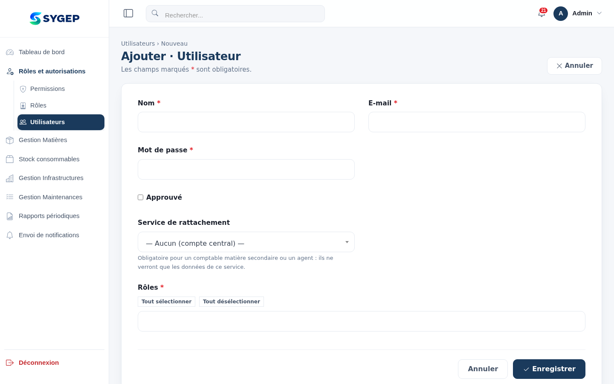

| Champ | Obligatoire | Règle |
|---|:-:|---|
| Nom | ✔ | Texte |
| E-mail | ✔ | **Unique** parmi les utilisateurs ; sert d'identifiant de connexion |
| Mot de passe | ✔ | À la création (pas de longueur minimale imposée par le formulaire) |
| Approuvé | | **À cocher** pour que le compte puisse se connecter |
| Service de rattachement | ✔ si le rôle est « local » | Obligatoire pour un comptable matière secondaire ou un agent |
| Rôles | ✔ | Au moins un |

**Règles importantes**

- Un compte **non approuvé** ne peut pas se connecter : il est déconnecté aussitôt avec le message « votre compte doit être approuvé par un administrateur ».
- Si vous choisissez un rôle « local » (comptable secondaire, agent) **sans service**, le formulaire est refusé : *« Le service de rattachement est obligatoire pour ce rôle. »*
- Pour **modifier** un mot de passe, l'utilisateur passe par son menu **Profil** (s'il a le droit `profile_password_edit`) ; un oubli se résout par la page « Mot de passe oublié » (nécessite la configuration du courrier).

### 4.5 Inscription libre : un point de sécurité à connaître

La page `/register` permet à **n'importe qui** de créer un compte. Ce compte :

1. est **non approuvé** : il ne peut rien faire tant qu'un administrateur ne l'a pas coché « Approuvé » ;
2. reçoit automatiquement le rôle nommé **`User`** (réglage `registration_default_role` dans `config/panel.php`).

Sur une installation **neuve**, le rôle `User` ne reçoit que les droits du profil « Agent / demandeur » (très limités). Sur une installation **ancienne**, ce rôle peut avoir reçu de nombreux droits : **vérifiez-le** dans *Rôles*, ou retirez-lui les droits sensibles.

> Si vous ne souhaitez pas d'inscription libre, demandez à un développeur de retirer les routes `register` (dans `routes/web.php`, remplacer `Auth::routes()` par `Auth::routes(['register' => false])`).

---

## 5. Se repérer dans l'application

### 5.1 L'écran d'accueil et la connexion


La page d'accueil publique présente le système. Les utilisateurs se connectent par `/login`.


### 5.2 La structure d'un écran

- **Menu de gauche** : les modules, regroupés. Les groupes ne s'affichent que si vous avez au moins un droit dedans. Le bouton **Déconnexion** est toujours visible en bas.
- **Barre du haut** : le bouton pour réduire le menu, la **recherche globale**, la **cloche de notifications** (avec le nombre non lu) et votre **menu de compte** (nom, e-mail, rôle, service, notifications, profil, déconnexion).
- **Zone centrale** : en haut le titre et les boutons d'action, puis les **chiffres clés**, un bloc repliable **Graphiques**, et le **tableau** de la liste.

### 5.3 Le menu

| Groupe | Contenu |
|---|---|
| **Tableau de bord** | Vue d'ensemble |
| **Rôles et autorisations** | Permissions, Rôles, Utilisateurs |
| **Gestion Matières** | Agents, Catégories, Services, Emplacements, Statuts des matières, Matières, Scanner un QR code, Historique matières, Affectations, Inventaires, Fournisseurs, Bons |
| **Stock consommables** | Articles en stock, Mouvements de stock, Bons de stock |
| **Gestion Infrastructures** | Infrastructures, Projets, Intervenants, Rapports, Chefs de projet |
| **Gestion Maintenances** | Statuts des tâches, Étiquettes, Tâches, Calendrier, Demandes de maintenance, Maintenance préventive |
| **Rapports périodiques** | Bilans imprimables pour la direction |
| **Envoi de notifications** | Écrire aux utilisateurs |

### 5.4 Les tableaux de liste

Toutes les listes fonctionnent pareil :

- **Recherche** instantanée (champ « Rechercher ») dans toutes les colonnes ;
- **Tri** en cliquant sur un en-tête de colonne ;
- **Pagination** (« Afficher 50 / 100 entrées ») ;
- bouton **Exporter** : copier, CSV, Excel, PDF, imprimer (les **colonnes visibles** sont exportées) ;
- bouton **Colonnes** : afficher ou masquer des colonnes ;
- **Tout sélectionner** : sélection de lignes (la suppression groupée n'est offerte que si vous avez le droit de supprimer) ;
- à droite de chaque ligne, des **icônes d'action** alignées : 👁 voir, ✏ modifier, 🗑 supprimer. Les actions propres à un module sont aussi des icônes (par exemple 🖨 imprimer un bon).

### 5.5 Les chiffres clés et les graphiques

Sur chaque écran de module, des **cartes de chiffres clés** résument la situation (par exemple « 18 Disponibles »). Les **graphiques** sont rangés dans un bloc repliable **« Graphiques (n) »**, fermé par défaut ; votre choix (ouvert ou fermé) est mémorisé dans votre navigateur.

Sur le **tableau de bord** : les actions rapides, huit tuiles de chiffres clés, trois listes (derniers mouvements, projets récents, demandes de maintenance) puis les graphiques en bas.

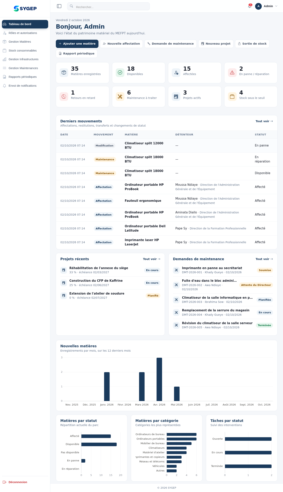

| Tuile | Ce qu'elle compte |
|---|---|
| Matières enregistrées | Toutes les matières |
| Disponibles | Matières au statut « Disponible » |
| Affectées | Matières rattachées à un **agent** ou à un **service** |
| En panne / réparation | Statuts « En panne » et « En réparation » |
| Retours en retard | Affectations **encore ouvertes** dont la date de retour prévue est dépassée |
| Maintenance à traiter | Demandes **ouvertes** (soumise, attente du Directeur, approuvée, planifiée, en cours) |
| Projets actifs | Projets **planifiés, en cours ou suspendus** |
| Stock sous le seuil | Articles dont le solde est **inférieur ou égal** au seuil d'alerte |

### 5.6 La recherche globale

Le champ **Rechercher…** en haut cherche, en tapant, dans les **catégories, matières, inventaires, fournisseurs, infrastructures et bons**, et propose les résultats cliquables.

### 5.7 Les notifications

La **cloche** affiche le nombre de notifications non lues. Une notification est un court message, avec parfois un lien vers la page concernée. Elles sont envoyées :

- **automatiquement** par l'application : nouvelle demande de maintenance à valider, avis technique à approuver par le Directeur, intervention planifiée, intervention terminée, maintenance préventive générée, **stock bas ou rupture** ;
- **manuellement** par un administrateur, depuis *Envoi de notifications* (voir 6.14).

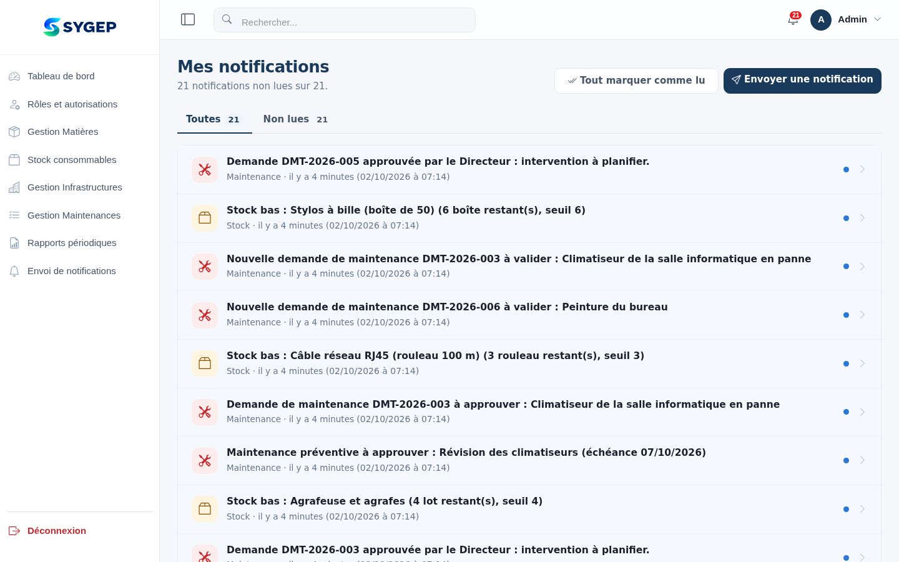

Vous pouvez ouvrir une notification (elle est alors marquée lue) ou utiliser « Tout marquer comme lu ».

---
## 6. Guide par module

Chaque section suit le même plan : **à quoi ça sert**, **les écrans**, **les champs et leurs règles**, **les procédures pas à pas**, **les cas particuliers**.

> **Lecture des tableaux de champs.** « Obligatoire » = le formulaire est refusé s'il est vide. Un message d'erreur en rouge s'affiche alors sous le champ concerné.

---

### 6.1 Les référentiels

Les référentiels sont les **listes de choix** utilisées partout ailleurs. Il faut les remplir **avant** de créer des matières.

| Référentiel | Chemin | Champs | Remarque |
|---|---|---|---|
| **Services** | Gestion Matières > Services | Nom (obligatoire) | Sert à rattacher agents, utilisateurs, affectations |
| **Catégories** | Gestion Matières > Catégories | Nom (obligatoire) | Ex. : Ordinateurs portables, Véhicules |
| **Emplacements** | Gestion Matières > Emplacements | Nom (obligatoire) | Ex. : Magasin central, CFP de Thiès — Atelier |
| **Statuts des matières** | Gestion Matières > Statuts des matières | Nom (obligatoire) | **Ne pas en créer d'autres sans besoin** : l'application s'appuie sur les cinq statuts décrits en 2.2 |
| **Fournisseurs** | Gestion Matières > Fournisseurs | Nom et contact (obligatoires) | Le contact est un texte libre (téléphone, e-mail…) |
| **Bons** (bons d'achat/livraison) | Gestion Matières > Bons | voir ci-dessous | Document d'acquisition rattaché aux matières reçues |

**Point d'attention** : rien n'empêche aujourd'hui de créer deux services, deux catégories ou deux fournisseurs **de même nom**. Veillez à ne pas créer de doublons.

#### Les bons (bons d'achat / de livraison)

Un **bon** garde la trace de l'**acquisition** de matières : qui a livré, selon quelle commande, quand.

| Champ | Obligatoire | Règle |
|---|:-:|---|
| Date d'émission | ✔ | |
| Organisation | ✔ | Plusieurs bons peuvent avoir la même organisation |
| Référence de commande | ✔ | **Unique** : deux bons ne peuvent pas porter la même référence |
| Nom du destinataire | ✔ | |
| Bon | ✔ | Le libellé ou numéro du bon ; c'est **lui qu'on choisit** dans le formulaire d'une matière |
| Date de livraison | | Doit être **égale ou postérieure** à la date d'émission. Vide = « en attente de livraison » |

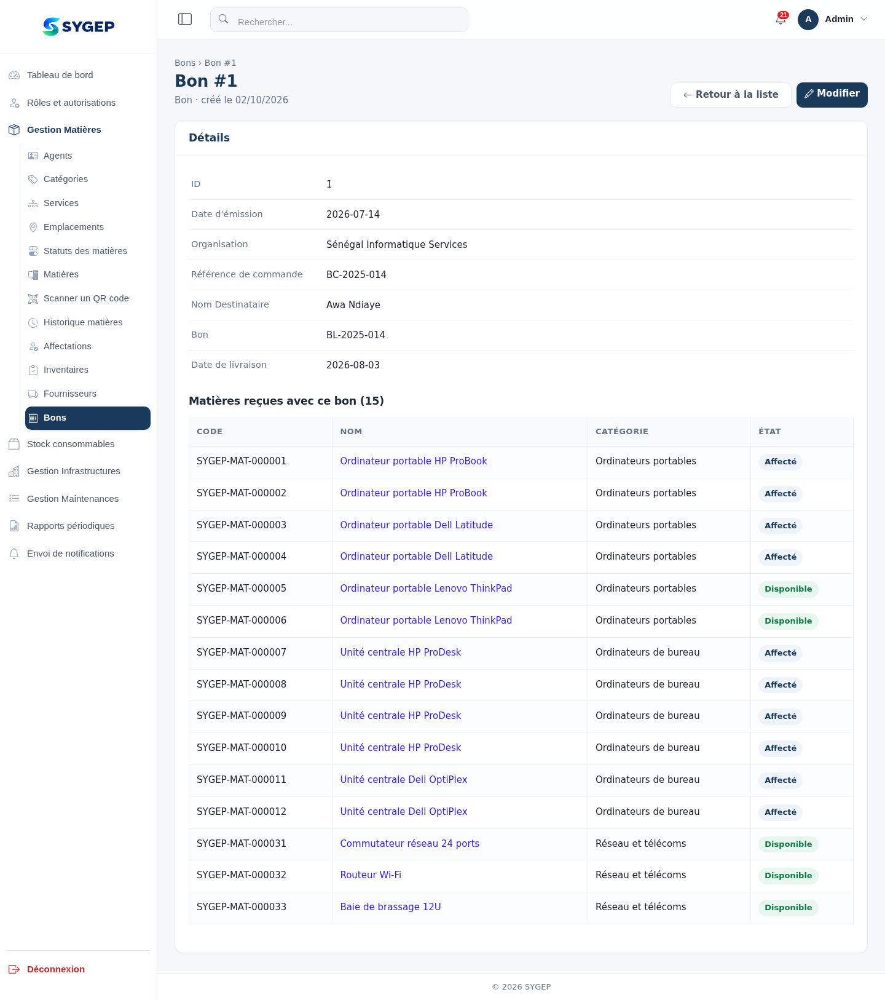

La **fiche d'un bon** (icône 👁) liste les **matières reçues avec ce bon** ; la liste des bons indique le **nombre de matières** par bon. Ce lien se fait quand on choisit le bon dans le formulaire d'une matière.

> Ne confondez pas : le **bon d'achat** (ci-dessus) fait *entrer* une matière dans le parc ; le **bon d'affectation** (6.4) la *remet* à un agent.

---

### 6.2 Les agents

**À quoi ça sert.** Un **agent** est un membre du personnel qui peut **recevoir du matériel** (un bénéficiaire d'affectation). Ce n'est **pas** un compte de connexion : un agent n'a pas forcément d'accès à l'application.

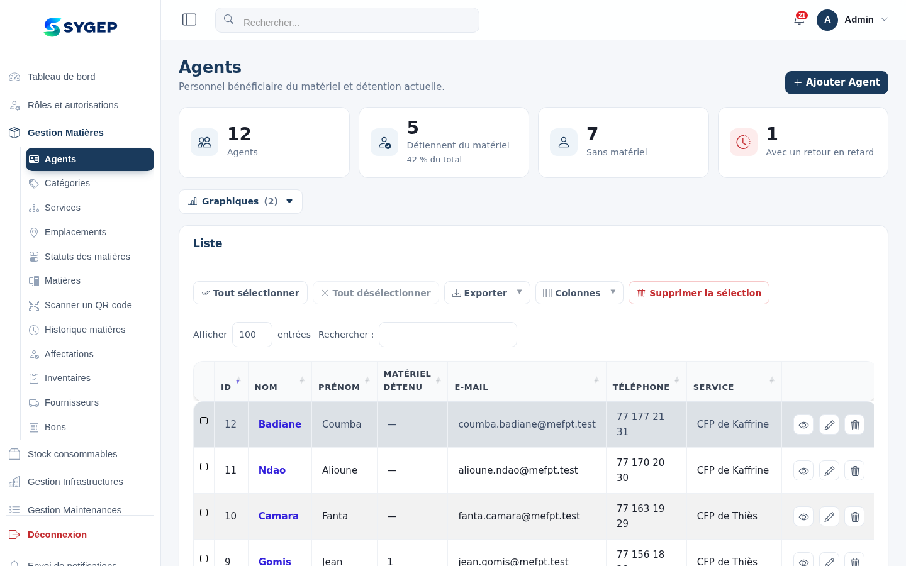

| Champ | Obligatoire | Règle |
|---|:-:|---|
| Nom | ✔ | |
| Prénom | ✔ | |
| Téléphone | ✔ | 20 caractères maximum |
| Service | ✔ | Doit exister |
| Adresse | | |
| E-mail | | Doit être valide s'il est rempli ; **n'a pas besoin d'être unique** |

La fiche d'un agent montre le **matériel qu'il détient** et ses **bons en cours**. La liste affiche, en haut, le nombre d'agents, de détenteurs de matériel et d'agents ayant un retour en retard.

---

### 6.3 Les matières

**À quoi ça sert.** Tenir le **registre du patrimoine durable** : chaque bien est enregistré avec son état, son emplacement, son acquisition, et son historique.

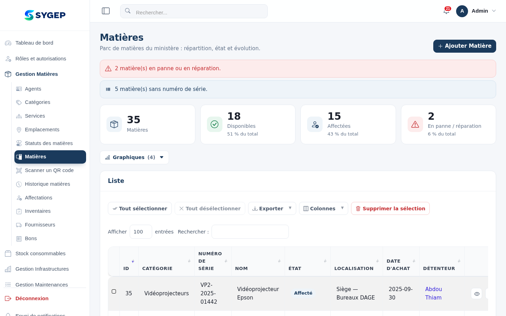

La liste montre les colonnes essentielles : ID, catégorie, numéro de série, nom, état, localisation, date d'achat, **détenteur**, et les actions. Le détail complet (notes, photos, fournisseur, bon, dates…) est dans la **fiche** (icône 👁).

#### Créer une matière

**Chemin :** *Gestion Matières > Matières > Ajouter une matière* (ou le bouton du tableau de bord).

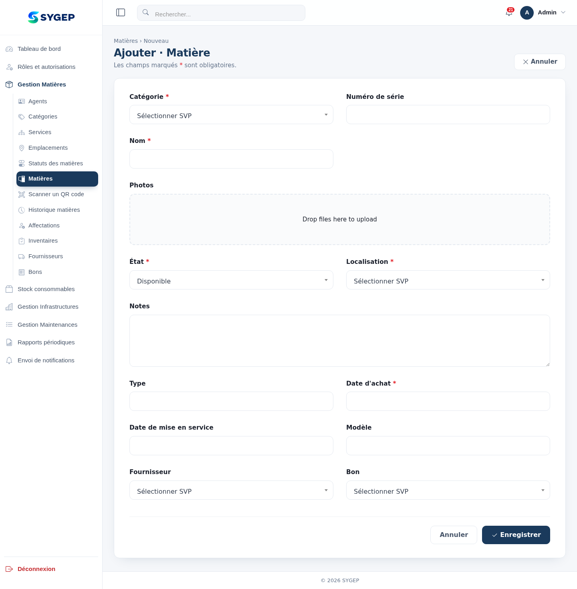

| Champ | Obligatoire | Règle |
|---|:-:|---|
| Catégorie | ✔ | |
| Nom | ✔ | |
| **État** | ✔ | À la création : **Disponible** (par défaut), Pas disponible ou En panne. « Affecté » et « En réparation » sont **refusés** : ils découlent d'une affectation ou d'une intervention |
| Localisation | ✔ | |
| **Date d'achat** | ✔ | **Pas dans le futur** |
| Numéro de série | | **Unique** s'il est rempli (deux matières ne peuvent pas avoir le même numéro) |
| Modèle | | |
| Type | | Texte libre, facultatif |
| Date de mise en service | | Doit être **égale ou postérieure** à la date d'achat |
| Fournisseur | | **Un seul** choix, facultatif (un don ou un ancien stock n'a pas de fournisseur) |
| Bon | | **Un seul** choix, facultatif |
| Photos | | Glisser-déposer ; **2 Mo maximum** par image |
| Notes | | |

À l'enregistrement, l'application **génère le code `SYGEP-MAT-xxxxxx`** (le code de l'étiquette QR) et écrit la première ligne de l'**historique**.

> Il n'existe plus de champ « utilisateur assigné » : le détenteur vient **uniquement** des affectations.

#### La fiche d'une matière

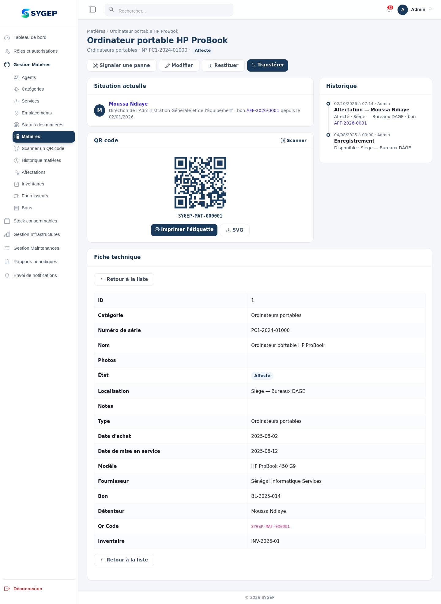

Elle comporte trois blocs : la **situation actuelle** (catégorie, état, localisation, **détenteur**, dates, modèle, fournisseur, bon, photos, notes), le **QR code** (avec téléchargement SVG et lien vers l'étiquette) et l'**historique** complet (création, affectations, restitutions, transferts, changements d'état, interventions, inventaires). Le bouton **Transférer** y est proposé.

#### L'étiquette QR

*Fiche > Étiquette* ouvre une page imprimable avec le QR code, le code et le nom, à coller sur le bien.

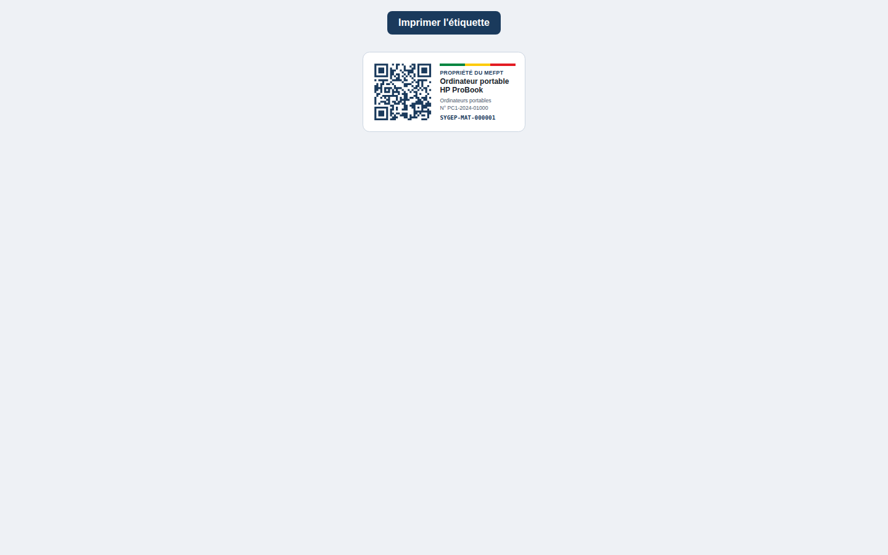

#### Transférer une matière

**Quand ?** Une matière détenue passe **directement d'un agent ou service à un autre**, sans repasser par le magasin.

**Chemin :** fiche de la matière > **Transférer**. Choisissez le **nouvel agent** ou le **nouveau service** (obligatoire : l'un des deux), la date, un emplacement, un motif. L'application **clôt l'affectation actuelle** pour cette matière (condition « Transféré ») et **crée un nouveau bon**.

#### L'historique des matières

*Gestion Matières > Historique matières* est le **journal** de tous les mouvements : date, type de mouvement, matière, détenteur, état, emplacement, **auteur**. Il se remplit automatiquement et **ne se modifie pas**.

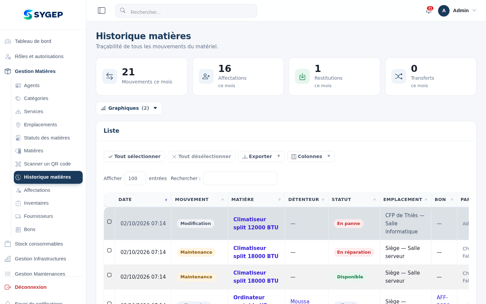

#### Le scanner de QR code

*Gestion Matières > Scanner un QR code* (voir 2.5).

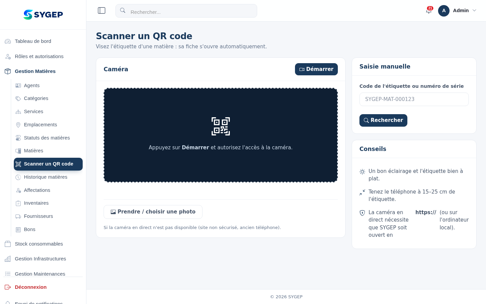

- **Caméra en direct** : bouton *Démarrer*. Nécessite **HTTPS** (ou l'ordinateur local).
- **Prendre une photo** : si la caméra en direct est indisponible.
- **Saisie manuelle** : tapez le **code d'étiquette**, un **numéro de série** ou le lien complet du QR.

Une fois le code lu, la **fiche de la matière** s'ouvre. Le scanner sert à **retrouver** une matière sans chercher dans la liste, à **contrôler sur le terrain** et à **pointer un inventaire** (6.5).

#### Supprimer une matière

La suppression est **logique** (la matière disparaît des listes mais l'historique est conservé).

---

### 6.4 Les affectations

**À quoi ça sert.** **Remettre du matériel** à un agent ou à un service, **par un bon numéroté** que le bénéficiaire signe, puis suivre le **retour**.

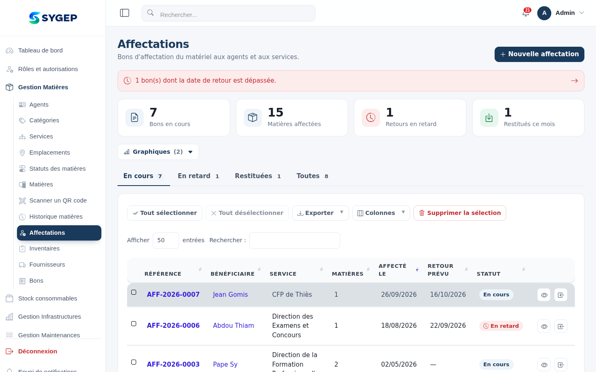

> **Transfert (utilisateur « local »).** Un utilisateur limité à son service peut transférer une matière **à un agent de son service uniquement** ; un transfert vers un autre service est refusé (404) et aucun bon n'est créé.

Les onglets **En cours / En retard / Restituées / Toutes** filtrent la liste. Une affectation est **en retard** quand elle est ouverte et que sa date de retour prévue est dépassée.

#### Créer une affectation

**Chemin :** *Gestion Matières > Affectations > Nouvelle affectation*.

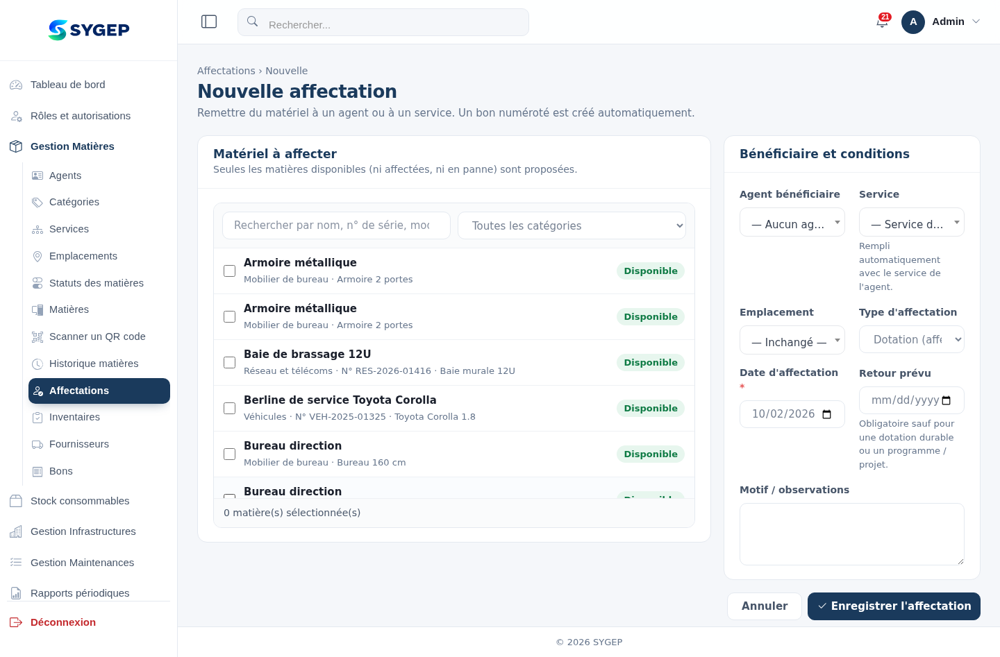

1. **Cochez les matières** à remettre. Seules les matières **« Disponibles »** sont proposées (ni affectées, ni en panne). S'il n'y en a aucune, l'écran l'indique.
2. Choisissez le **bénéficiaire** : un **agent** (son service est alors pris automatiquement) **ou** un **service**. L'un des deux est obligatoire.
3. Choisissez le **type** d'affectation et les **dates**.
4. Validez : l'application **crée le bon** (`AFF-AAAA-nnnn`), passe chaque matière à **« Affecté »**, enregistre le détenteur et écrit l'historique.

| Type | Usage | Date de retour prévue |
|---|---|:-:|
| **Dotation** (affectation durable) | Équipement remis durablement | Facultative |
| **Mise à disposition temporaire** | Prêt limité dans le temps | **Obligatoire** |
| **Réservation** | Matériel réservé | **Obligatoire** |
| **Formation** | Pour une session de formation | **Obligatoire** |
| **Programme / projet** | Rattaché à un programme | Facultative |
| **Envoi en maintenance** | Envoi en réparation | **Obligatoire** |

Autres champs : date d'affectation (obligatoire), **emplacement** (« Inchangé » par défaut), motif/observations (2000 caractères maximum). La date de retour ne peut pas précéder la date d'affectation.

#### Le bon d'affectation imprimé

*Fiche > Imprimer le bon.*

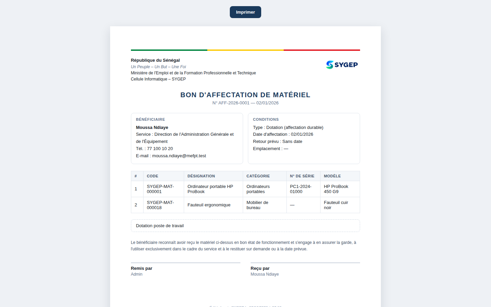

Il comporte : l'en-tête de la République et du ministère, le numéro et la date, le **bénéficiaire** (avec service, téléphone, e-mail), les **conditions** (type, dates, emplacement), le **tableau des matières** (code, désignation, catégorie, numéro de série, modèle), les notes, le **texte d'engagement** du bénéficiaire et les deux **cases de signature** (« Remis par », « Reçu par »).

#### Enregistrer un retour (restitution)

**Chemin :** fiche de l'affectation > **Restituer** (droit `assignment_return` requis).

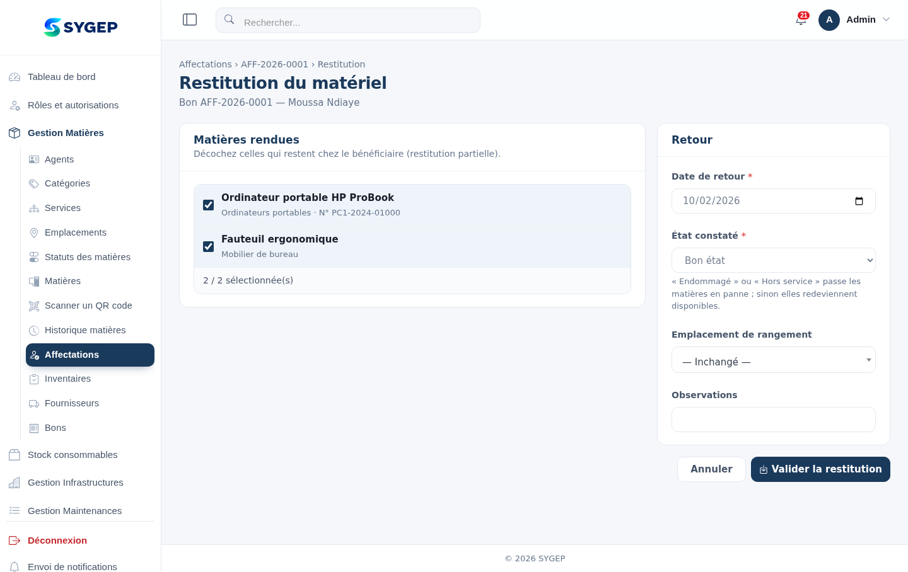

| Champ | Obligatoire | Règle |
|---|:-:|---|
| Matières à restituer | ✔ | Cochez **au moins une** ; on peut restituer **une partie** seulement |
| État au retour | ✔ | Bon état · Usé · Endommagé · Hors service |
| Date de retour | ✔ | Pas dans le futur |
| Emplacement | | Où la matière est rangée |
| Notes | | 255 caractères maximum |

**Effets** : la matière redevient **Disponible** (ou **En panne** si l'état est « Endommagé » ou « Hors service »), son détenteur est effacé, l'historique est mis à jour. L'affectation passe à **Partielle** tant qu'il reste du matériel détenu, puis à **Restituée** quand tout est rendu.

#### Supprimer un bon

Supprimer un bon d'affectation **libère les matières encore détenues** (elles redeviennent disponibles).

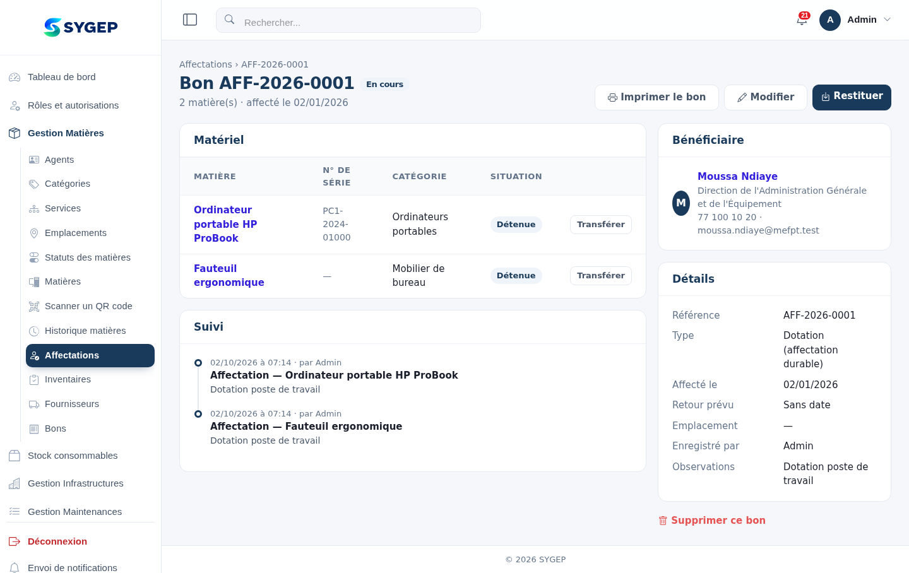

---

### 6.5 Les inventaires

**À quoi ça sert.** Organiser une **campagne de contrôle physique** : on vérifie, matière par matière, que ce qui est enregistré est bien là, au bon endroit, en bon état — puis on produit un **procès-verbal**.

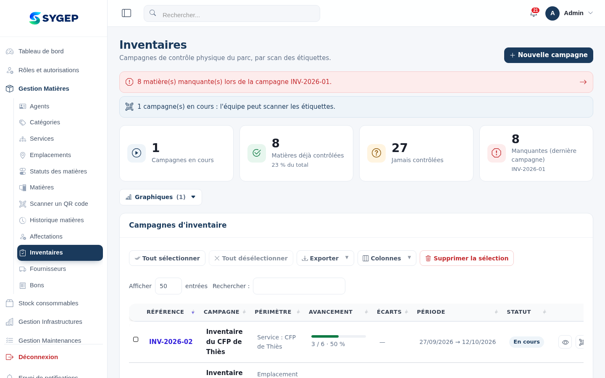

#### Le déroulement d'une campagne

| Étape | Statut | Qui | Ce qui se passe |
|---|---|---|---|
| 1. **Préparer** | En préparation | Droit `inventaire_create` | Donner un nom, un **périmètre** (emplacement, service, catégorie — **facultatifs et cumulables** ; vide = tout le parc), des dates prévues, des consignes |
| 2. **Démarrer** | En cours | Droit `inventaire_edit` | L'application **dresse la liste** des matières attendues d'après le périmètre : toutes à l'état « À contrôler » |
| 3. **Contrôler** | En cours | Équipe terrain (droit `inventaire_edit`) | Scanner chaque étiquette (ou **Pointer** à la main) |
| 4. **Clôturer** | Clôturé | **Droit `inventaire_close`** (comptable principal, super administrateur) | Les matières non contrôlées passent à **« Manquante »** ; option de mise à jour des fiches |
| 5. **Procès-verbal** | — | Tous | Document imprimable |

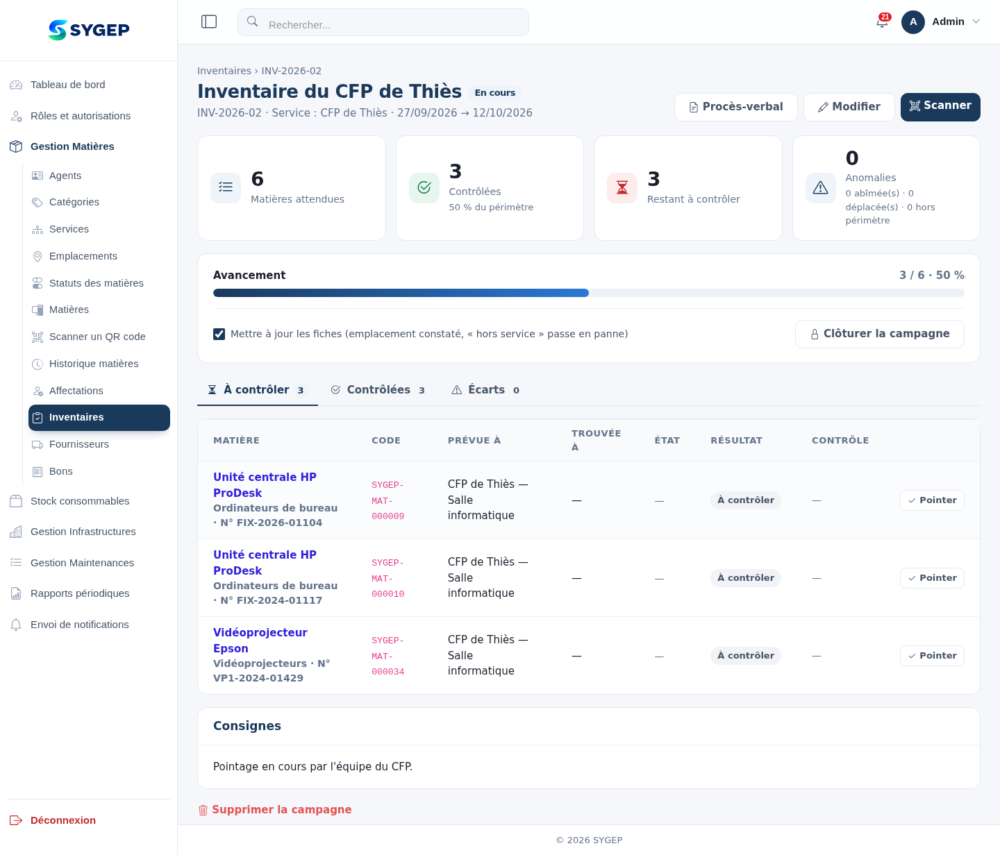

#### Le contrôle

Pour chaque matière lue, l'application enregistre un **résultat** et un **état constaté** :

| Résultat | Signification |
|---|---|
| **À contrôler** | Attendue, pas encore vue |
| **Contrôlée** | Vue, dans le périmètre |
| **Trouvée hors périmètre** | Vue alors qu'elle n'était pas attendue (elle est **ajoutée** à la campagne) |
| **Manquante** | Attendue mais jamais vue (attribué à la clôture) |

États constatés : **Bon état, Usé, Abîmé, Hors service**. Lire deux fois la même étiquette affiche « Déjà contrôlée » sans rien doubler.

**Le scanner d'inventaire** (bouton *Scanner*) fonctionne comme le scanner général, avec en plus le choix de l'**état constaté** et du **lieu du contrôle**.

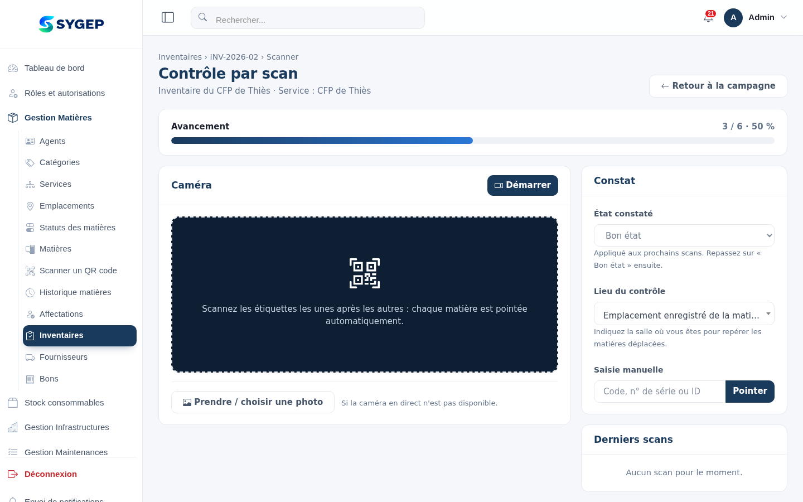

#### La clôture

La case **« Mettre à jour les fiches »** (cochée par défaut) applique les constats :

- si l'emplacement **constaté** diffère de l'emplacement enregistré → la fiche de la matière est **corrigée** ;
- si l'état constaté est **« Hors service »** → la matière passe à **« En panne »**.

Chaque correction est **inscrite dans l'historique** avec la mention « Mise à jour suite à l'inventaire INV-… ». Une campagne clôturée ne peut plus être modifiée.

#### Le procès-verbal

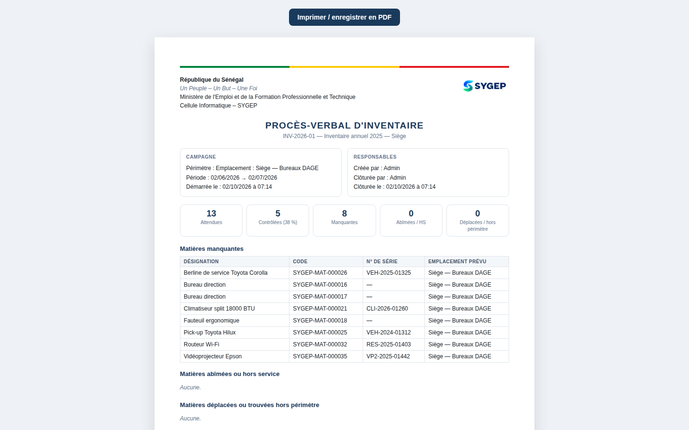

Il comporte : la **campagne** (nom, référence, périmètre, dates), les **responsables** (cases de signature), puis les listes d'écarts : **matières manquantes** (ou restant à contrôler si la campagne est en cours), **matières abîmées ou hors service**, et **matières déplacées ou trouvées hors périmètre** (avec l'emplacement prévu et l'emplacement constaté).

---

### 6.6 Le stock des consommables

**À quoi ça sert.** Suivre les articles **en quantité** (papier, toner, produits d'entretien, carburant…) : combien il en reste, qui les a reçus, quand il faut recommander.

Le module a trois parties : les **articles**, les **mouvements** et les **bons**.

> **Sortie et alertes.** Une sortie peut être faite **pour un agent** (le service est alors déduit de l'agent) ou pour un service. Une alerte « stock bas » est émise quand la quantité franchit le seuil minimum **et** une alerte « rupture » quand elle tombe à zéro.

#### Les articles

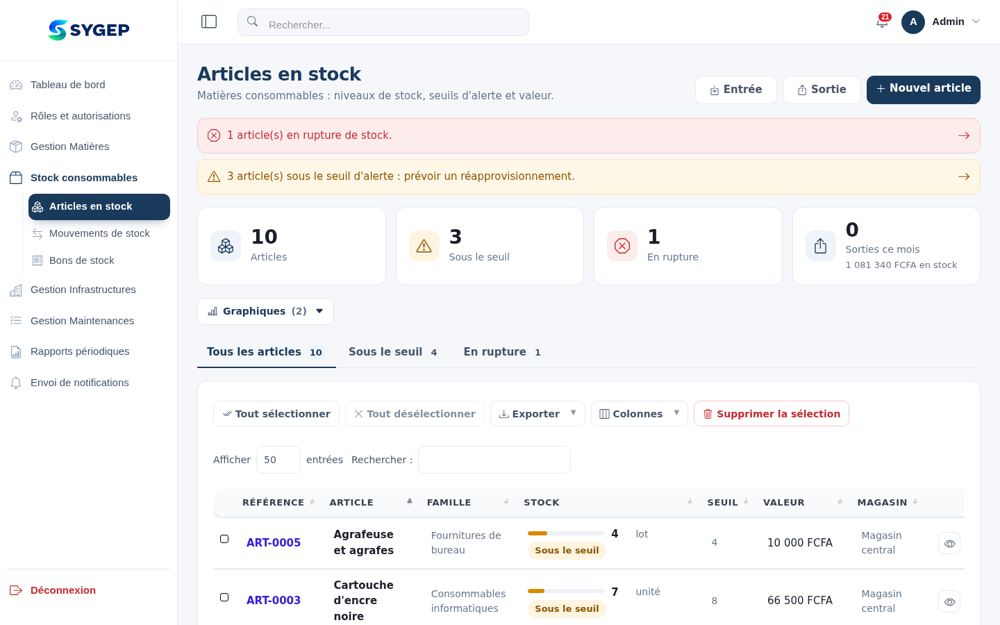

**Chemin :** *Stock consommables > Articles en stock > Ajouter*.

| Champ | Obligatoire | Règle |
|---|:-:|---|
| Désignation | ✔ | Ex. : « Ramette papier A4 80 g » |
| Unité de gestion | ✔ | unité, ramette, boîte, carton, paquet, rouleau, litre, kg, mètre, lot (ou libre) |
| **Seuil d'alerte** | ✔ | Niveau à partir duquel l'alerte est déclenchée (0 = alerte seulement à l'épuisement) |
| Famille | | Fournitures de bureau, Consommables informatiques, Matières d'œuvre / pédagogiques, Produits d'entretien, Pièces détachées, Carburant et lubrifiants, Denrées périssables, Autre |
| Quantité en stock aujourd'hui | | **À la création seulement** ; enregistrée comme **première entrée** de stock |
| Prix unitaire (FCFA) | | |
| Fournisseur habituel | | |
| Magasin / lieu de stockage | | |
| Matière périssable | | Case à cocher : impose une **date de péremption** à chaque entrée |
| Observations | | |

La **quantité n'est jamais saisie à la main** après la création : elle est **calculée à partir des mouvements**. Ainsi le solde est toujours justifié.

La **fiche d'un article** montre son solde, ses statistiques (entrées et sorties du mois, sorties de l'année, **consommation moyenne mensuelle**, **couverture en jours**) et l'historique de ses mouvements.

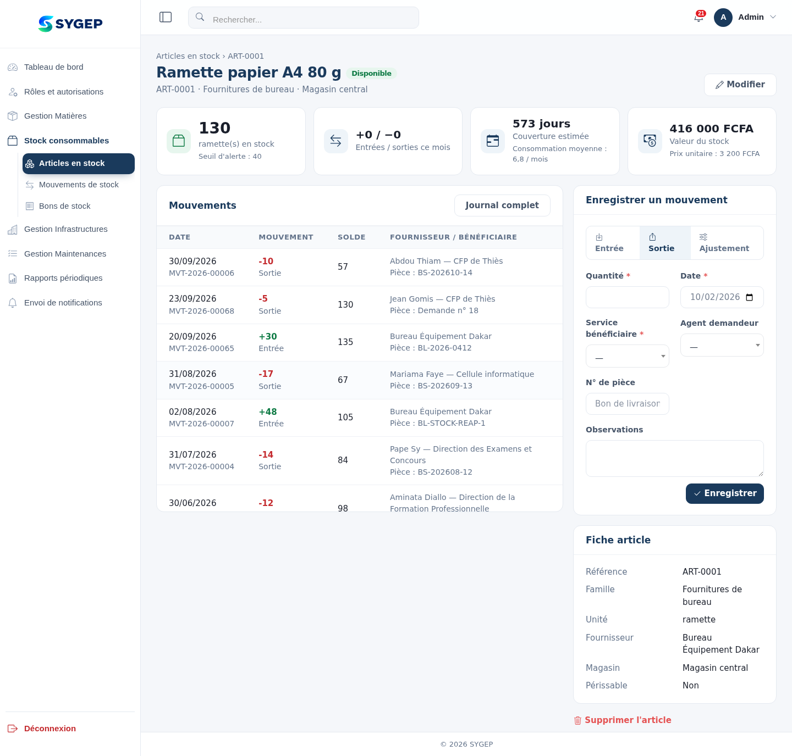

#### Les mouvements

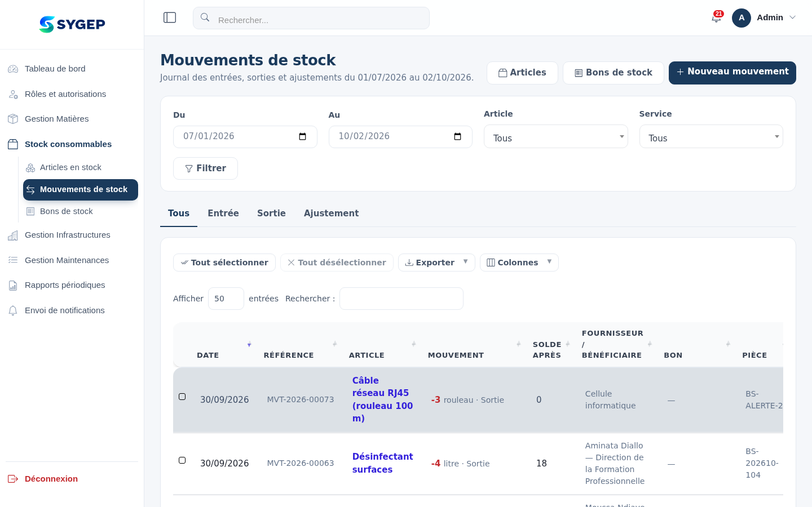

Chaque variation du stock est un **mouvement**, de trois types :

| Type | Effet | Règles |
|---|---|---|
| **Entrée** | Le solde **augmente** | Fournisseur, prix unitaire, N° de pièce facultatifs ; **date de péremption obligatoire** si l'article est périssable ; la péremption doit suivre la date du mouvement |
| **Sortie** | Le solde **diminue** | **Service bénéficiaire obligatoire** (ou un agent, dont le service est repris) ; **refusée** si elle dépasse le stock (« Stock insuffisant : il reste X ») |
| **Ajustement** | Le solde est **recalé** sur la quantité comptée | Réservé au droit `stock_movement_adjust` ; **observations obligatoires** (expliquer l'écart) ; refusé si la quantité comptée égale déjà le stock |

Règles communes : la **quantité doit être supérieure à zéro** (sauf ajustement) et la **date ne peut pas être dans le futur**. Chaque mouvement reçoit un numéro `MVT-AAAA-nnnnn` et enregistre le **solde après** mouvement et son **auteur**.

> **Le magasin central enregistre les entrées.** Un comptable limité à un service ne peut enregistrer que des **sorties** de son service.

**L'alerte de stock bas.** Quand un mouvement fait **passer** le solde de « au-dessus du seuil » à « au niveau du seuil ou en dessous », les utilisateurs ayant le droit de modifier les articles reçoivent une notification **« Stock bas »** ou **« Rupture de stock »** (si le solde est nul), avec un lien vers l'article. Les articles concernés comptent aussi dans la tuile « Stock sous le seuil ».

#### Les bons d'entrée et de sortie

**À quoi ça sert.** Quand on reçoit ou qu'on distribue **plusieurs articles à la fois**, on établit **un seul bon**, imprimable et signé, plutôt qu'un mouvement par article.

**Chemin :** *Stock consommables > Bons de stock*, puis **Bon d'entrée** ou **Bon de sortie**.

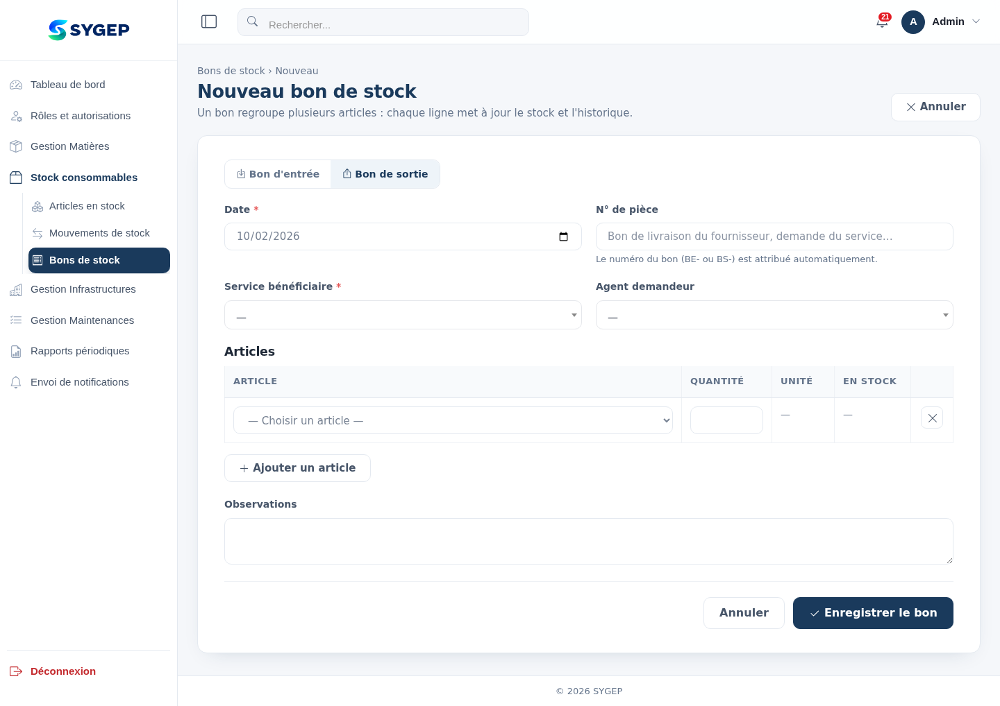

| Champ | Règle |
|---|---|
| Type | **Bon d'entrée** ou **Bon de sortie** (un compte local ne voit que le bon de sortie) |
| Date | Obligatoire, pas dans le futur |
| N° de pièce | Facultatif (bon de livraison du fournisseur, numéro de la demande du service…) |
| Fournisseur *(entrée)* | Facultatif |
| Service bénéficiaire *(sortie)* | **Obligatoire** |
| Agent demandeur *(sortie)* | Facultatif |
| **Lignes d'articles** | Au moins **une** ; un **même article ne peut figurer qu'une fois** ; quantité > 0 ; en entrée : prix unitaire et date de péremption (obligatoire si périssable) |
| Observations | Facultatif |

Le bouton **Ajouter un article** ajoute une ligne ; l'unité et le **stock actuel** s'affichent dès qu'on choisit l'article.

**À l'enregistrement**, tout se fait **en une seule opération** : le bon reçoit son numéro (`BE-AAAA-nnnn` ou `BS-AAAA-nnnn`), un **mouvement est créé pour chaque ligne**, les soldes sont mis à jour, les alertes éventuelles sont envoyées. **Si une ligne est refusée** (stock insuffisant, péremption manquante), **rien n'est enregistré** et le message s'affiche **sur la ligne fautive**.

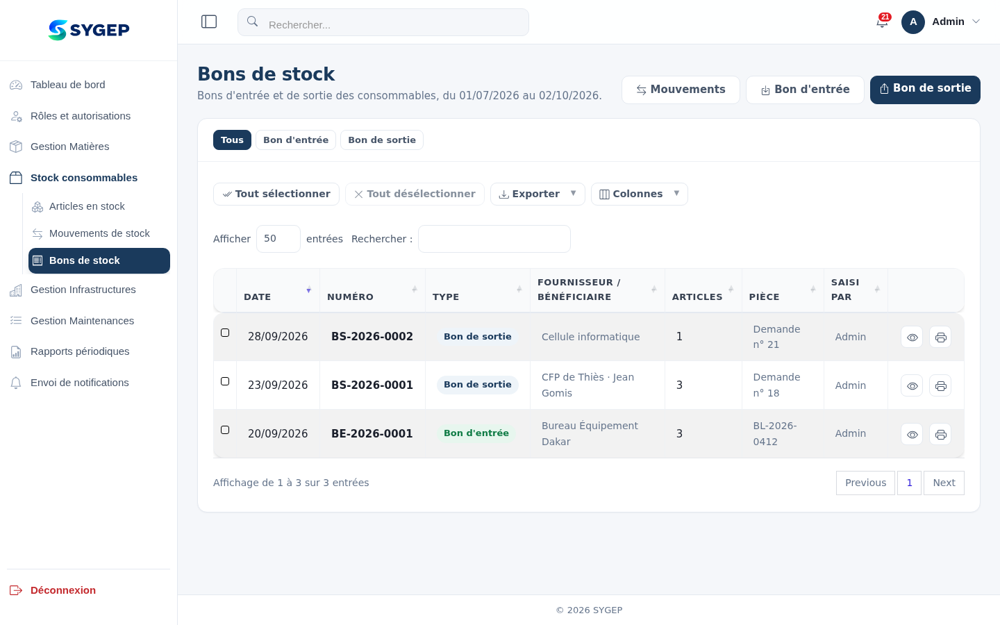

Le **bon imprimé** (icône 🖨) reprend le style du bon d'affectation, avec le tableau des articles (code, désignation, quantité, unité, prix en entrée) et les signatures :

- **Bon d'entrée** : « Livré par » / « Reçu par (magasinier) » ;
- **Bon de sortie** : « Remis par (magasinier) » / « Reçu par ».

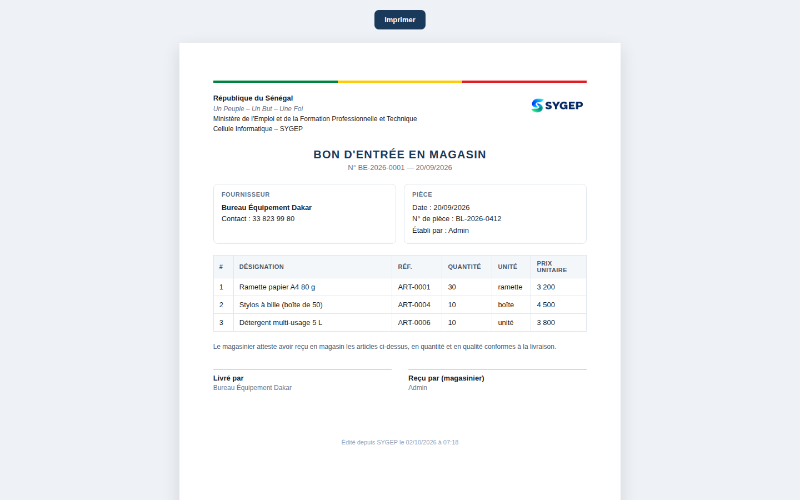

> Le formulaire « Nouveau mouvement » (un seul article) reste disponible, notamment pour un **ajustement après comptage**.

---

### 6.7 Les infrastructures

**À quoi ça sert.** Suivre le **patrimoine immobilier** : sites, bâtiments, salles — leur état, leurs visites, leur valeur et leur amortissement.

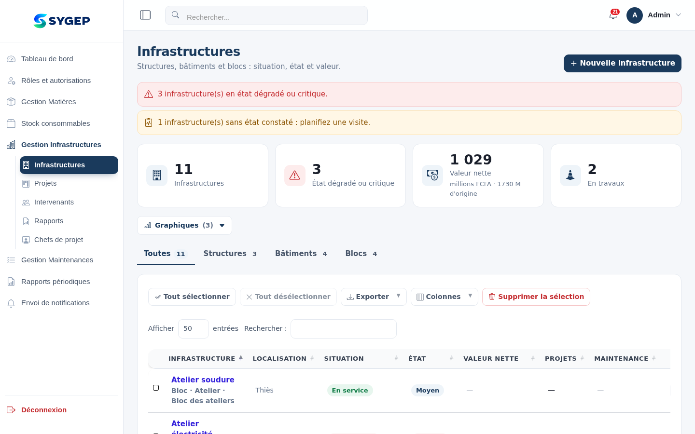

#### La hiérarchie

Les infrastructures forment un **arbre à trois niveaux** :

```
Structure (centre, lycée, institut…)        <- site principal, ne se rattache à rien
 └─ Bâtiment                                <- se rattache à une structure
     └─ Bloc / salle / atelier              <- se rattache à un bâtiment (ou directement à une structure)
```

Le formulaire **contrôle** ces rattachements (message d'erreur sinon).

#### Les champs

| Champ | Obligatoire | Règle |
|---|:-:|---|
| Nom | ✔ | |
| Nature | ✔ | Structure, Bâtiment, Bloc / salle / atelier |
| **Situation** | ✔ | En service · En construction · En réhabilitation · En maintenance · Hors service |
| Rattachée à | | Selon la hiérarchie ci-dessus |
| Usage | | Texte libre (ex. « Salle de formation ») |
| Localisation | | Ville, quartier |
| **État constaté** | | Non évalué · Bon · Moyen · Dégradé · Critique |
| Date de la dernière visite | | Pas dans le futur |
| Surface (m²) | | ≥ 0 |
| Description | | |

#### L'amortissement

Pour valoriser un bâtiment, remplissez **les trois** champs suivants **ensemble** (sinon le formulaire demande les manquants) :

| Champ | Rôle |
|---|---|
| **Valeur d'origine** (FCFA) | Valeur d'acquisition ou de construction |
| **Mise en service** | Date de départ de l'amortissement |
| **Durée** (années) | De 1 à 100 ans |

L'amortissement est **linéaire** :

- **annuité** = valeur d'origine ÷ durée ;
- **part amortie** à une date = jours écoulés depuis la mise en service ÷ jours totaux de la durée (0 avant la mise en service, 100 % après la fin) ;
- **valeur nette comptable** = valeur d'origine × (1 − part amortie).

La fiche affiche le **plan d'amortissement année par année** (annuité, cumul, valeur nette). Laissez les trois champs vides si l'infrastructure n'est pas valorisée.

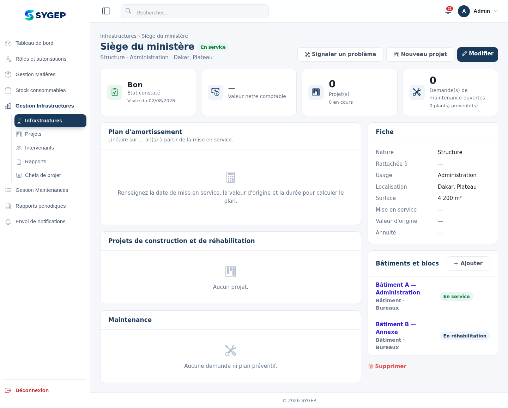

La fiche présente aussi : les **bâtiments et blocs** rattachés, les **projets** qui la concernent, et sa **maintenance** (demandes et plans), avec un bouton **« Signaler un problème »** qui ouvre une demande de maintenance.

---

### 6.8 Les projets

**À quoi ça sert.** Suivre les **chantiers** (construction, réhabilitation, extension, équipement) : budget, calendrier, jalons, avancement, intervenants.

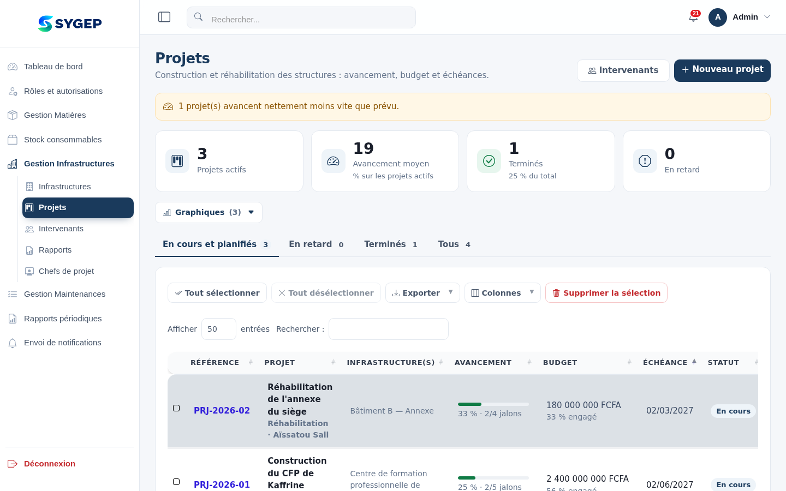

#### Les champs

| Champ | Obligatoire | Règle |
|---|:-:|---|
| Intitulé | ✔ | |
| Nature des travaux | ✔ | Construction · Réhabilitation · Extension · Équipement / modernisation |
| Statut | ✔ | Planifié · En cours · Suspendu · Terminé · Annulé |
| Date de démarrage | ✔ **si** En cours, Suspendu ou Terminé | Un projet lancé a forcément démarré |
| Date de fin prévue | | Ne peut pas précéder le démarrage |
| Budget prévu (FCFA) | | ≥ 0 |
| Montant engagé / décaissé (FCFA) | | ≥ 0 ; **ne peut pas dépasser le budget prévu** (une alerte rouge s'affiche en direct, puis le formulaire est refusé : relevez d'abord le budget) |
| Avancement physique (%) | | De 0 à 100 ; **calculé automatiquement** dès qu'il y a des jalons |
| Chef(s) de projet | | Plusieurs possibles |
| Infrastructure(s) concernée(s) | | Plusieurs possibles |
| Description / objectifs | | |

Un projet « **Terminé** » sans jalon passe automatiquement à **100 %**.

#### Les jalons et l'avancement

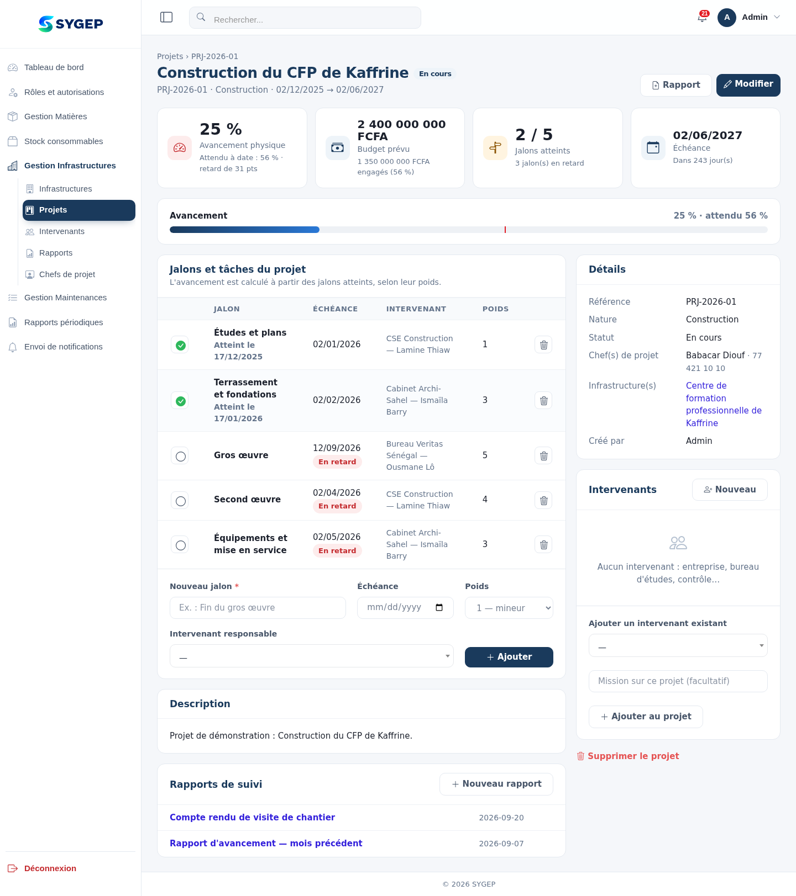

Sur la **fiche du projet**, la section **Jalons et tâches du projet** permet d'**ajouter des jalons**, chacun avec un titre, une échéance, un **poids** (de 1 à 10 : un gros jalon pèse plus), un intervenant et une description. On **coche** un jalon quand il est atteint.

**L'avancement est alors calculé** : somme des poids des jalons atteints ÷ somme de tous les poids. Le statut suit :

| Situation | Effet automatique |
|---|---|
| Au moins un jalon atteint et projet « Planifié » | Passe à **En cours** |
| Tous les jalons atteints (100 %) et projet « Planifié » ou « En cours » | Passe à **Terminé** (date de fin réelle enregistrée) |
| Un jalon décoché alors que le projet est « Terminé » | Revient à « En cours » |

Un projet est **en retard** quand il est actif et que sa date de fin prévue est dépassée.

La fiche contient aussi les **intervenants** du projet (« Ajouter au projet ») et les **rapports de suivi**.

---

### 6.9 Intervenants, chefs de projet et rapports de projet

#### Les chefs de projet

Ce sont les **responsables internes** des projets.

| Champ | Obligatoire | Règle |
|---|:-:|---|
| Nom, Prénom | ✔ | |
| Téléphone **ou** e-mail | ✔ (au moins un) | Pour pouvoir le joindre ; l'e-mail doit être valide |
| Adresse | | |

#### Les intervenants

Ce sont les **acteurs externes** des projets : entreprises, bureaux d'études, contrôleurs…

| Champ | Obligatoire | Règle |
|---|:-:|---|
| Type d'intervenant | ✔ | Entreprise de travaux · Bureau d'études · Maître d'œuvre · Bureau de contrôle · Fournisseur · Technicien / artisan · Autre |
| Nom du contact | ✔ | |
| Entreprise / organisme | ✔ **sauf** « Technicien / artisan » et « Autre » | |
| Téléphone **ou** e-mail | ✔ (au moins un) | |
| Prénom, adresse, observations | | |

#### Les rapports de projet

*Gestion Infrastructures > Rapports* : un **rapport de suivi** est un **document déposé** (un seul fichier, 25 Mo maximum), daté, rattaché à **un ou plusieurs projets**. Il apparaît dans la fiche des projets concernés.

| Champ | Obligatoire | Règle |
|---|:-:|---|
| Titre | ✔ | |
| Document du rapport | ✔ | Un fichier (PDF, Word…) |
| Date du rapport | ✔ | Pas dans le futur |
| Projet(s) | ✔ | Au moins un |

---

### 6.10 Les demandes de maintenance

**À quoi ça sert.** Signaler une **panne ou un besoin d'intervention** et le **faire traiter selon un circuit** qui garde la trace des avis et des décisions.

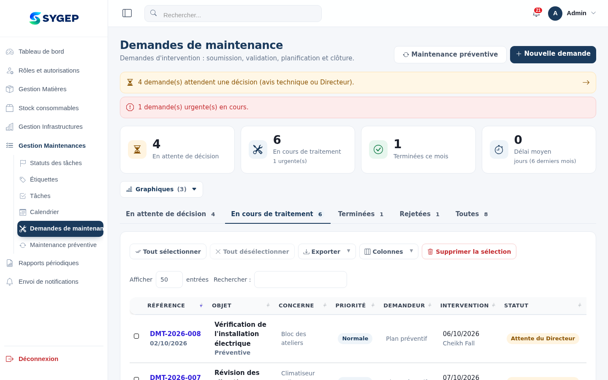

#### Déposer une demande

**Chemin :** *Gestion Maintenances > Demandes de maintenance > Ajouter* (tout utilisateur ayant le droit de créer ; un agent ne voit ensuite que ses demandes et celles du matériel de son service).

| Champ | Obligatoire | Règle |
|---|:-:|---|
| Objet | ✔ | Ex. : « Fuite d'eau dans la salle B2 » |
| Type | ✔ | Corrective (panne, dégradation) · Préventive (entretien planifié) |
| Priorité | ✔ | Basse · Normale · Haute · Urgente |
| Concerne | ✔ | Bâtiment / infrastructure · Matière / équipement · Autre |
| Infrastructure | ✔ si « Concerne » = infrastructure | |
| Matière / équipement | ✔ si « Concerne » = matière | |
| **Description du problème** | ✔ | Constat, localisation, depuis quand : sans cela, le responsable ne peut pas évaluer |
| Établissement demandeur | | |

#### Le circuit

```
Soumise ──(avis technique)──► Attente du Directeur ──(approbation)──► Approuvée
   │                                  │                                  │
   └────────── Rejetée ◄──────────────┘                      Planifiée ◄─┤
                                                                │         │
                                                         En cours ◄───────┘
                                                                │
                                                            Terminée
```

| Étape | Qui (droit) | Ce qui se passe |
|---|---|---|
| **Soumission** | Le demandeur | Statut « Soumise ». Les responsables maintenance sont **notifiés** |
| **Avis technique** | Responsable maintenance (`maintenance_request_validate`) | Valider → « Attente du Directeur » (le Directeur est notifié). **Rejeter** exige un **motif** |
| **Approbation** | Directeur (`maintenance_request_approve`) | Approuver → « Approuvée ». Rejeter exige un **motif** |
| **Planification** | Responsable maintenance (droit de modifier) | Choisir la **date prévue** (obligatoire), une **échéance** (≥ date prévue), un **technicien** et des **instructions**. Une **tâche** est créée automatiquement dans le planning ; le technicien est notifié |
| **Démarrage** | Idem | « En cours ». Si la demande concerne une **matière**, elle passe à **« En réparation »** ; si elle concerne une infrastructure **urgente** et « En service », celle-ci passe à « En maintenance » |
| **Clôture** | Idem | Voir ci-dessous |

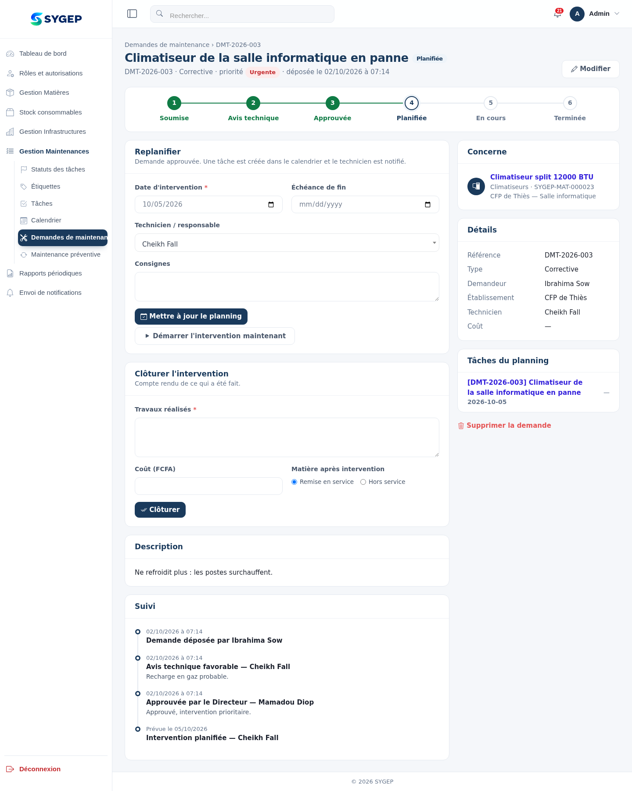

#### La clôture d'une intervention

| Champ | Obligatoire | Effet |
|---|:-:|---|
| Intervention réalisée | ✔ | Compte rendu de ce qui a été fait |
| Coût (FCFA) | | |
| Remise en service | | Cochée → la matière redevient **Disponible** (ou **Affecté** si elle l'était). **Non cochée → « En panne »** |
| État de l'infrastructure | | Met à jour l'état constaté ; la date de dernière visite passe à aujourd'hui ; une infrastructure « En maintenance » repasse « En service » |

Le **demandeur** est notifié de la clôture. La tâche liée passe à « Terminée ».

---

### 6.11 La maintenance préventive

**À quoi ça sert.** **Programmer les entretiens récurrents** (révision des climatiseurs, contrôle des extincteurs) pour que les demandes se créent **toutes seules**.

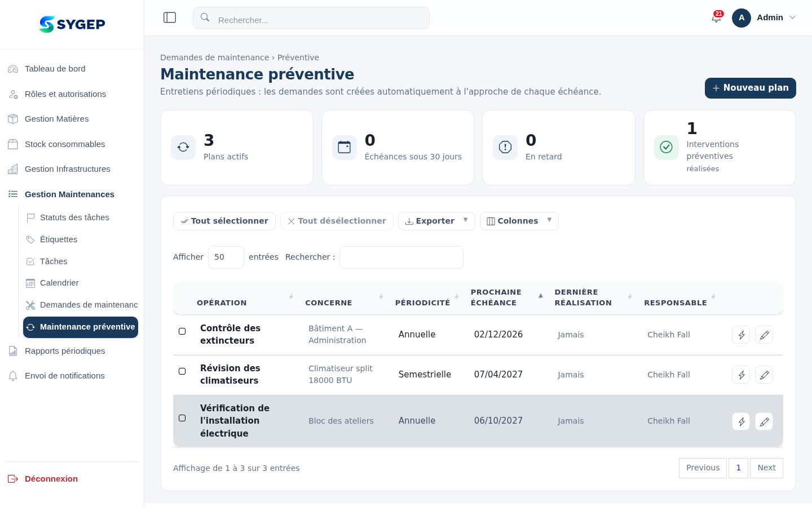

| Champ | Obligatoire | Règle |
|---|:-:|---|
| Opération d'entretien | ✔ | |
| Concerne | ✔ | Bâtiment / infrastructure ou Matière |
| Infrastructure / Matière | ✔ selon le choix | |
| Périodicité | ✔ | Mensuelle · Trimestrielle · Semestrielle · Annuelle · Tous les 2 ans |
| **Prochaine échéance** | ✔ | **Pas dans le passé** à la création |
| **Créer la demande … jours avant** | ✔ | De 0 à 90 ; doit rester **inférieur à la périodicité** (30 jours × le nombre de mois) |
| **Points de contrôle** | ✔ | La liste des vérifications à faire à chaque opération |
| Responsable | | Reçoit une notification à chaque génération |
| Plan actif | | Décocher pour suspendre le plan |

**Fonctionnement.** Chaque jour à 6 h 30 (et à l'ouverture du module), l'application **cherche les plans dont la date « échéance − délai » est atteinte** et **crée la demande préventive** correspondante, déjà passée par l'**avis technique** ; elle est donc directement **soumise à l'approbation du Directeur**. Dès qu'une demande est générée, l'**échéance du plan avance** d'une période (par exemple + 6 mois pour un plan semestriel). Un plan **ne génère pas de nouvelle demande tant que la précédente est encore ouverte**. Le bouton **Lancer** (icône ⚡) d'un plan force la création immédiate. À la **clôture** de l'intervention, la date « dernière réalisation » du plan est mise à jour.

---

### 6.12 Les tâches et le calendrier

**À quoi ça sert.** Organiser le **travail des techniciens et des équipes** : une tâche a un état, une date prévue, une échéance, un responsable, des étiquettes et du matériel concerné.

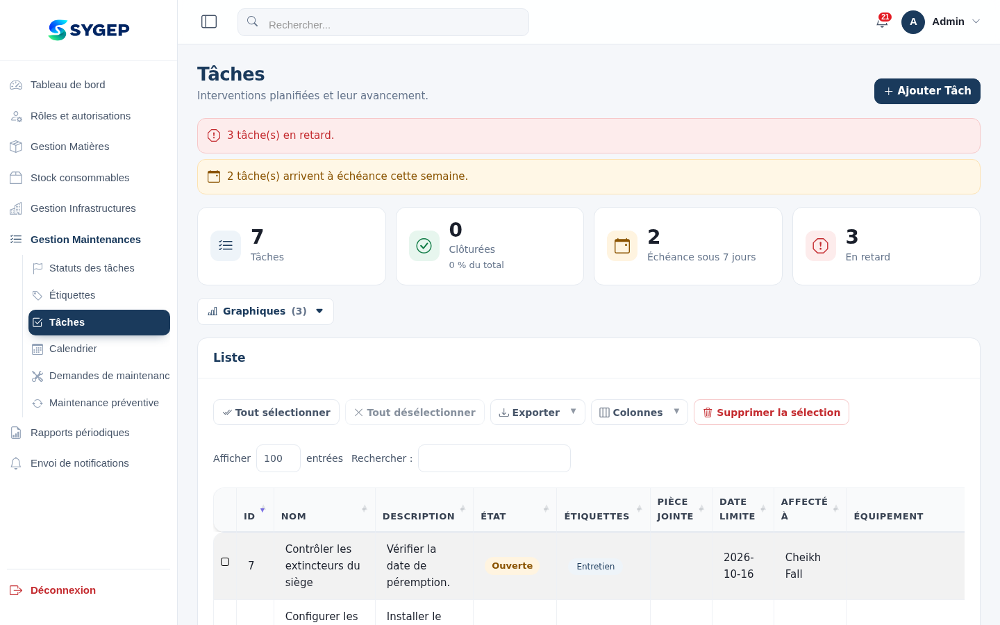

| Champ | Obligatoire | Règle |
|---|:-:|---|
| Nom | ✔ | |
| État | ✔ | **Ouverte · En cours · Terminée** |
| Date prévue | ✔ | |
| Date limite | | **Ne peut pas précéder la date prévue** |
| Affecté à | | Un utilisateur |
| Étiquettes | | Plusieurs ; se gèrent dans *Étiquettes* (Urgent, Électricité, Plomberie…) |
| Équipement | | Plusieurs matières ; affichées par **nom et code** |
| Description, pièce jointe | | |

Les tâches créées par la **planification d'une demande de maintenance** apparaissent ici automatiquement et changent d'état avec l'intervention (Ouverte → En cours → Terminée).

Le **Calendrier** présente les tâches **qui ont une date limite**, placées à cette date (une tâche sans date limite n'y figure pas).

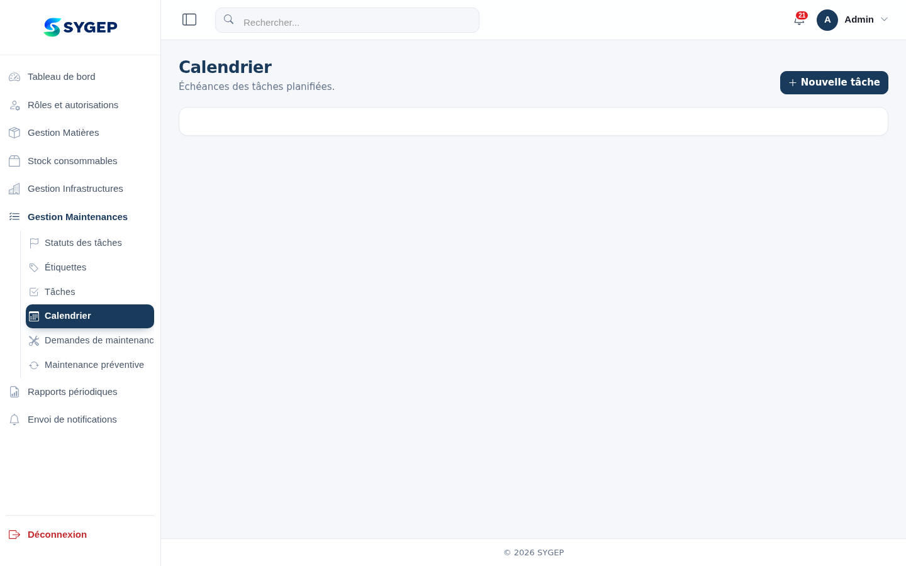

> Les **statuts de tâches** se gèrent dans *Statuts des tâches*. Le circuit de maintenance reconnaît un statut par son **sens** (« ouvert/ouvrir », « cours », « terminé/clôturé/fermé »), en français ou en anglais : gardez ces trois états.

---

### 6.13 Les rapports périodiques

**À quoi ça sert.** Produire des **bilans imprimables pour la direction** : patrimoine, stock, maintenance, projets, infrastructures.

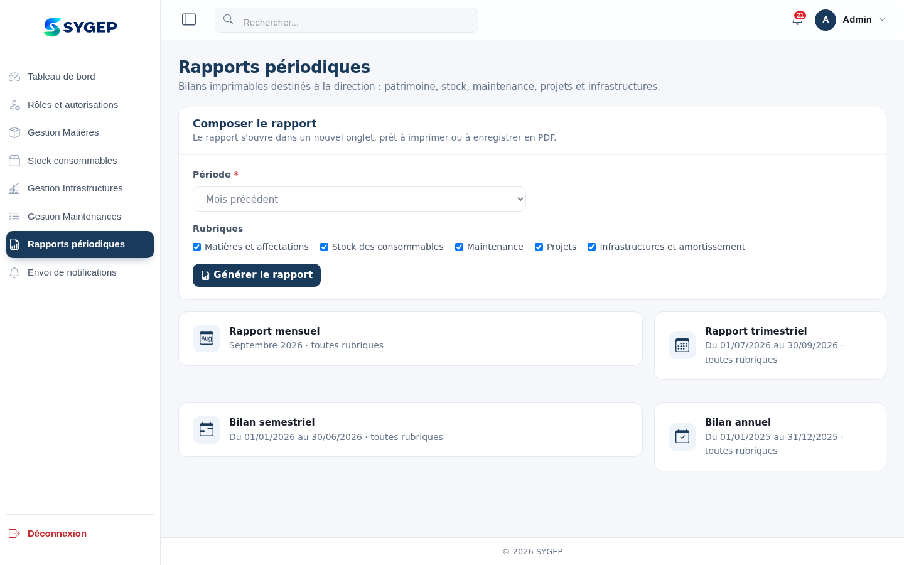

**Chemin :** *Rapports périodiques*.

1. Choisissez la **période** : mois en cours / précédent, trimestre en cours / précédent, **semestre en cours / précédent**, année en cours / précédente, ou période personnalisée (du… au…).
2. Cochez les **rubriques** : Matières et affectations · Stock des consommables · Maintenance · Projets · Infrastructures et amortissement.
3. Le rapport s'ouvre dans **un nouvel onglet**, prêt à **imprimer** ou à **enregistrer en PDF**.

Quatre **cartes rapides** produisent le rapport mensuel (mois précédent), trimestriel (trimestre précédent), semestriel (**semestre précédent**) et annuel (année précédente), toutes rubriques.

---

### 6.14 L'envoi de notifications

**À quoi ça sert.** Écrire à des utilisateurs : une annonce, un rappel d'inventaire…

**Chemin :** *Envoi de notifications > Ajouter* (droit de créer des notifications).

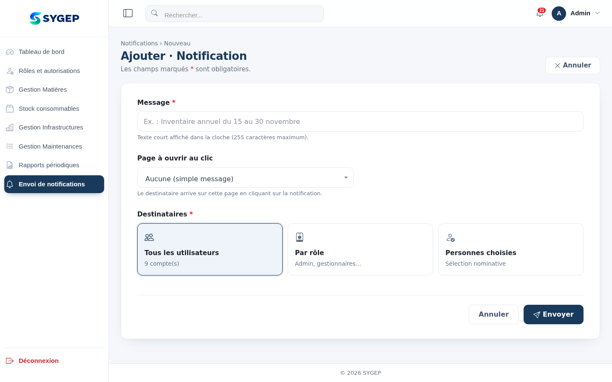

| Champ | Obligatoire | Règle |
|---|:-:|---|
| Message | ✔ | **255 caractères maximum** ; s'affiche dans la cloche |
| Page à ouvrir au clic | | Une page de SYGEP, ou « Aucune (simple message) », ou une adresse personnalisée (alors **obligatoire** et complète : `https://…`) |
| **Destinataires** | ✔ | **Tous les utilisateurs**, **Par rôle** (au moins un rôle) ou **Personnes choisies** (au moins une) |

Après l'envoi, l'écran indique à **combien d'utilisateurs** la notification a été remise (une personne ayant plusieurs rôles n'est comptée qu'une fois). L'envoi est **immédiat**.

---

### 6.15 Le site public et la page Contact

- La **page d'accueil** (`/`) présente SYGEP. Un utilisateur connecté qui l'ouvre est redirigé vers son tableau de bord.
- La page **Contact** (`/contact`) permet à un visiteur d'écrire à la cellule informatique : nom, e-mail, téléphone, structure, objet et message. Elle est **protégée** contre les envois en rafale (5 par minute) et par un champ piège anti-robots.
- Chaque message reçu **notifie** les utilisateurs ayant le droit de lire les messages de contact, et un bandeau « nouveaux messages de contact à lire » s'affiche sur leur tableau de bord. Ils les lisent dans l'espace de gestion.
- Les **coordonnées** affichées viennent du fichier `.env` (voir 3.3).

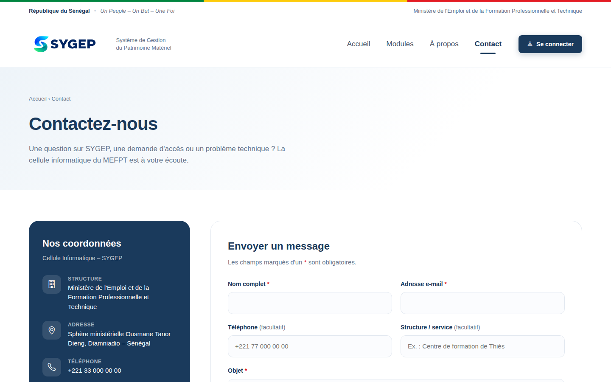

---

## 7. Les règles de gestion en un coup d'œil

Cette page rassemble les règles que l'application **fait respecter**. Elle est utile pour répondre à « pourquoi le formulaire refuse ça ? ».

### Matières et affectations

| Règle | Détail |
|---|---|
| État à la création | « Affecté » et « En réparation » interdits ; « Disponible » par défaut |
| Date d'achat | Pas dans le futur ; la mise en service ne la précède pas |
| Numéro de série | Unique s'il est rempli |
| Affecter | Seules les matières « Disponibles » sont proposables ; un bénéficiaire (agent **ou** service) est obligatoire |
| Date de retour prévue | Obligatoire sauf pour une dotation et un programme/projet ; jamais avant la date d'affectation |
| Restituer | Au moins une matière ; date de retour pas dans le futur ; « Endommagé » ou « Hors service » → la matière passe « En panne » |
| Transférer | Nouveau bénéficiaire obligatoire ; l'affectation actuelle est clôturée (« Transféré ») |

### Stock

| Règle | Détail |
|---|---|
| Quantité | > 0 (sauf ajustement) ; le solde ne devient jamais négatif |
| Sortie | Service bénéficiaire obligatoire (ou agent) |
| Ajustement | Droit spécial, observations obligatoires, refusé s'il n'y a pas d'écart |
| Article périssable | Date de péremption obligatoire à chaque entrée, postérieure à la date du mouvement |
| Date | Jamais dans le futur |
| Bon de stock | Au moins une ligne, un article **une seule fois** ; tout ou rien |
| Alerte | À chaque **franchissement** du seuil vers le bas |
| Comptes locaux | Sorties de leur service **uniquement** |

### Inventaires, infrastructures, projets

| Règle | Détail |
|---|---|
| Inventaire | Démarrer fige la liste des attendues ; clôturer rend « Manquantes » les non contrôlées ; clôture réservée au droit `inventaire_close` |
| Hiérarchie des infrastructures | Structure → Bâtiment → Bloc (contrôlée) |
| Amortissement | Valeur d'origine + mise en service + durée : **les trois ensemble** |
| Projet lancé | Date de démarrage obligatoire (En cours, Suspendu, Terminé) |
| Budget | Le montant engagé ne dépasse pas le budget prévu |
| Avancement | Calculé par les poids des jalons ; statut du projet ajusté automatiquement |

### Maintenance

| Règle | Détail |
|---|---|
| Description | Obligatoire sur une demande |
| Rejet | Motif obligatoire |
| Planification | Date prévue obligatoire ; échéance ≥ date prévue |
| Clôture | Compte rendu obligatoire ; non remise en service → matière « En panne » |
| Plan préventif | Échéance pas dans le passé ; délai < périodicité ; points de contrôle obligatoires ; pas de doublon tant qu'une demande est ouverte |

### Comptes

| Règle | Détail |
|---|---|
| Connexion | Compte **approuvé** requis |
| Rôle « local » | Service de rattachement obligatoire |
| E-mail utilisateur | Unique |

---

## 8. Exploitation, sauvegarde et dépannage

### 8.1 Sauvegarder

Il y a **deux choses** à sauvegarder :

1. **La base de données** (toutes les données) :
   ```bash
   mysqldump -u UTILISATEUR -p NOM_DE_LA_BASE > sygep-AAAA-MM-JJ.sql
   ```
2. **Les fichiers déposés** (photos des matières, pièces jointes, rapports) : le dossier `storage/app/public/` (et `storage/app/` s'il contient d'autres fichiers).

Conservez aussi une copie du fichier **`.env`** (il contient les accès à la base) dans un endroit **sûr et séparé**.

**Rythme conseillé** : une sauvegarde de la base **chaque nuit**, conservée au moins 30 jours, et une copie **hors du serveur**. **Testez la restauration** au moins une fois : une sauvegarde jamais restaurée n'est qu'une hypothèse.

**Restaurer** :
```bash
mysql -u UTILISATEUR -p NOM_DE_LA_BASE < sygep-AAAA-MM-JJ.sql
```

### 8.2 Les journaux

Les erreurs sont écrites dans `storage/logs/laravel.log`. Le dossier `storage/` et `bootstrap/cache/` doivent être **modifiables par le serveur web**. Quand une page affiche « Erreur du serveur » (500), **la ligne la plus récente de ce fichier** donne la cause.

### 8.3 Tableau de dépannage

| Symptôme | Cause probable | Solution |
|---|---|---|
| La page s'affiche **sans mise en forme** (texte brut) | Les bibliothèques externes (CDN) ne se chargent pas : pas d'accès Internet ou site bloqué | Vérifier l'accès à `cdn.jsdelivr.net` ; sinon héberger les bibliothèques localement |
| **Rien ne bouge** quand on clique (menus, boutons) | Erreur JavaScript, ou ancienne version en cache | `Ctrl + F5` ; ouvrir la console (F12 > Console) et relever la ligne rouge |
| Une modification **n'apparaît pas** | Cache du navigateur ou des pages | `Ctrl + F5` ; `php artisan view:clear` |
| **403 Interdit** | Le rôle n'a pas le droit | Vérifier le rôle de l'utilisateur dans *Rôles* |
| **419 Page expirée** | Session ou jeton expiré | Recharger la page et recommencer |
| Un utilisateur **ne peut pas se connecter** | Compte non approuvé, ou mauvais mot de passe | Cocher « Approuvé » dans la fiche utilisateur ; réinitialiser le mot de passe |
| Un comptable secondaire / un agent **ne voit aucune donnée** | Pas de service de rattachement | Rattacher l'utilisateur à un service |
| Un menu **manque** | Aucun droit dans ce groupe | Ajuster les droits du rôle |
| La **caméra** du scanner ne démarre pas | Site en `http://` (hors ordinateur local) | Servir le site en **HTTPS** ; en attendant, utiliser « Prendre une photo » ou la saisie manuelle |
| Les **QR codes** pointent vers une mauvaise adresse | `APP_URL` incorrect au moment de l'impression | Corriger `APP_URL`, puis **réimprimer** les étiquettes |
| Les **plans préventifs** ne créent rien | Le planificateur n'est pas installé | Ajouter la ligne `cron` (3.4) ou utiliser le bouton « Lancer » |
| « **Stock insuffisant** » | La sortie dépasse le solde | Vérifier le solde ; faire une entrée ou un ajustement avant |
| Les **graphiques** manquent sur une page | Erreur SQL en arrière-plan (consulter les journaux) | Lire `storage/logs/laravel.log` |
| `Class "App\Support\PermissionCatalog" not found` | Fichier non versionné (voir 10.1) | Ajouter ce fichier au dépôt |
| `SQLSTATE ... Duplicate entry` en installant | Ancienne procédure de seeders | Mettre à jour le code puis `php artisan migrate --seed` |
| Erreur 500 sans détail | `APP_DEBUG=false` (normal en production) | Lire le journal ; activer `APP_DEBUG` **temporairement** en test seulement |

### 8.4 Bonnes pratiques d'exploitation

- **Un compte par personne** ; ne jamais partager un mot de passe.
- **Désactiver** (décocher « Approuvé ») les comptes des personnes qui partent, plutôt que de les supprimer : l'historique garde le nom de l'auteur.
- Faire les **mises à jour hors des heures de travail**, après sauvegarde.
- **Vérifier chaque mois** la tuile « Stock sous le seuil », les retours en retard et les demandes en attente.
- **Clôturer les inventaires** : une campagne laissée « En cours » garde des matières « à contrôler ».

---

## 9. Architecture technique

### 9.1 La pile technologique

| Couche | Technologie |
|---|---|
| Langage / cadre | PHP 8.3, **Laravel 13** |
| Interface | Pages **Blade** (rendu côté serveur), **CoreUI 3** + Bootstrap 4, icônes Bootstrap Icons, **DataTables** (listes), **Select2**, **Dropzone** (dépôt de fichiers), **Chart.js** (graphiques), **html5-qrcode** (scanner) |
| Base de données | MySQL / MariaDB |
| Fichiers | **Spatie Media Library** (photos, pièces jointes) |
| QR codes | `simplesoftwareio/simple-qrcode` |
| API | Laravel **Sanctum** (jetons) — voir 9.6 |

### 9.2 Organisation du code

```
app/
  Http/
    Controllers/Admin/   un contrôleur par module (écrans de gestion)
    Controllers/Auth/    connexion, inscription, mot de passe
    Middleware/          AuthGates (droits), ApprovalMiddleware (comptes approuvés)
    Requests/            règles de validation des formulaires
  Models/                les objets métier (Asset, Assignment, StockItem…)
    Concerns/ScopedByService.php   filtrage automatique par service
  Observers/             AssetsHistoryObserver : historique automatique
  Services/              la logique métier (voir 9.3)
  Support/               RoleProfiles, Perimetre, Fmt, Tone, PermissionCatalog*
config/panel.php         réglages propres à SYGEP
database/
  migrations/            structure de la base (à appliquer dans l'ordre)
  seeders/               données de base ; DemoDataSeeder = démonstration
resources/views/         pages Blade (admin/, partials/, layouts/, qr/…)
routes/web.php           toutes les adresses de l'application
routes/console.php       commandes sygep:* et planificateur
public/css, public/js    styles et scripts propres à SYGEP
docs/                    ce guide et le cahier de recette
```

\* `PermissionCatalog` : voir 10.1.

### 9.3 La logique métier : les « services »

Les règles importantes ne sont **pas** dans les contrôleurs mais dans des classes dédiées, ce qui garantit qu'elles s'appliquent partout de la même façon :

| Service | Rôle |
|---|---|
| `AffectationService` | Créer un bon d'affectation, enregistrer les retours, transférer ; met à jour les statuts, les détenteurs et l'historique |
| `InventaireService` | Démarrer une campagne, enregistrer un contrôle, annuler un contrôle, clôturer |
| `StockService` | **Seul point d'entrée** pour modifier un solde de stock ; calcule le solde, refuse les sorties impossibles, déclenche les alertes |
| `StockVoucherService` | Créer un bon d'entrée/sortie : un bon, plusieurs mouvements, **tout ou rien** |
| `MaintenanceWorkflow` | Le circuit des demandes : soumettre, valider, approuver, rejeter, planifier, démarrer, clôturer ; génère les demandes préventives |
| `Notifier` | Envoie les notifications internes (à des personnes ou à tous ceux qui ont un droit) |
| `ModuleOverview` | Calcule les chiffres clés et les graphiques de chaque écran de module |
| `PeriodicReport` | Calcule les périodes et le contenu des rapports périodiques |

### 9.4 Les droits, techniquement

- Les droits sont des lignes de la table `permissions`, liées aux rôles (`permission_role`) et les rôles aux utilisateurs (`role_user`).
- Le middleware **`AuthGates`** déclare, à chaque requête, une règle d'accès par droit. Les vues utilisent `@can('asset_create')`, les contrôleurs `Gate::denies(...)`.
- **`RoleProfiles`** définit les neuf profils métier (droits autorisés / refusés) ; `php artisan sygep:profils` les applique.
- **`Perimetre`** détermine si l'utilisateur est « local » (droit `perimetre_service`). Le trait **`ScopedByService`** ajoute alors automatiquement `WHERE service_id = …` à toutes les requêtes des modèles concernés (agents, matières, historique, affectations, inventaires, mouvements et bons de stock, services), et **interdit** d'enregistrer hors de son service.

### 9.5 La base de données

| Table | Contenu |
|---|---|
| `users`, `roles`, `permissions`, `role_user`, `permission_role` | Comptes, rôles, droits |
| `services`, `agents` | Organisation et bénéficiaires |
| `asset_categories`, `asset_locations`, `asset_statuses`, `suppliers`, `bons` | Référentiels et acquisitions |
| `assets`, `assets_histories`, `asset_supplier`, `asset_bon` | Matières, leur historique, leurs fournisseurs et bons |
| `assignments`, `asset_assignment`, `assignment_service`… | Bons d'affectation et leurs lignes (matières, retours) |
| `inventaires`, `asset_inventaire` | Campagnes et contrôles (résultat, état, lieu, date, auteur) |
| `stock_items`, `stock_movements`, `stock_vouchers` | Articles, mouvements, bons de stock |
| `infrastructures`, `projects`, `project_milestones`, `chef_projets`, `intervenants`, `reports`, `infrastructure_project`, `chef_projet_project`, `intervenant_project`, `project_report` | Patrimoine immobilier et projets |
| `maintenance_requests`, `maintenance_plans`, `maintenance_request_task` | Maintenance |
| `tasks`, `task_statuses`, `task_tags`, `task_task_tag`, `asset_task` | Tâches |
| `user_alerts`, `user_user_alert` | Notifications et leurs destinataires |
| `contact_messages` | Messages de la page Contact |
| `media` | Fichiers déposés (Spatie) |

**Conventions** : les dates sont stockées au format `AAAA-MM-JJ` ; de nombreux objets utilisent la **suppression logique** (`deleted_at`) — l'objet disparaît des listes mais reste en base ; les références automatiques sont décrites en 2.4.

### 9.6 L'API

Une API REST minimale existe sous `/api/v1` (authentification **Sanctum**) : lecture de l'**historique des matières** et gestion des **bons**. L'interface web ne l'utilise pas et l'application ne propose **aucun écran de création de jeton** : elle n'est pas exploitable en l'état. Ne l'ouvrez pas à l'extérieur sans l'avoir étudiée.

### 9.7 Tests automatisés

Le dépôt ne contient que les tests d'exemple de Laravel. La **vérification fonctionnelle** repose sur le [cahier de recette](CAHIER-DE-RECETTE.md).

---

## 10. Points d'attention connus

> **Sécurité corrigée pendant la pré-recette.** Les URL directes vers une matière, une affectation ou un bon d'un autre service renvoyaient la fiche à un utilisateur « local » ; elles renvoient désormais 404 (le périmètre `perimetre_service` est appliqué aussi à la résolution des routes). Voir le cas SEC-12 du cahier de recette.

Cette section est **volontairement franche** : ce sont des limites ou des risques que vous devez connaître.

### 10.1 Un fichier manque dans le dépôt GitHub : `app/Support/PermissionCatalog.php`

Les pages **Rôles** (liste, création, modification, fiche) l'utilisent pour regrouper les droits par section. Il existe sur la machine de développement, mais n'a **jamais été versionné** (il était masqué par une ligne erronée du fichier `.gitignore`, corrigée depuis). Conséquence : **sur toute nouvelle installation faite depuis GitHub, les pages Rôles plantent** (« Class App\Support\PermissionCatalog not found »).

**À faire, sur la machine où le fichier existe :**
```bash
git add app/Support/PermissionCatalog.php
git commit -m "Ajouter PermissionCatalog"
git push
```
Vérifiez aussi `git status` : d'autres fichiers autrefois ignorés peuvent apparaître et mériter d'être versionnés.

### 10.2 Doublons de noms possibles

Aucune règle n'empêche de créer **deux services, catégories, emplacements, fournisseurs ou étiquettes de même nom**. Soyez vigilant, ou demandez l'ajout d'une règle d'unicité.

### 10.3 Inscription libre et rôle `User`

Voir 4.5 : l'inscription libre crée des comptes **non approuvés** avec le rôle `User`. Sur une base ancienne, vérifiez les droits de ce rôle, ou désactivez l'inscription.

### 10.4 Dépendance à Internet

L'interface charge ses bibliothèques depuis `cdn.jsdelivr.net` et les polices depuis `fonts.bunny.net`. Sans Internet, les pages s'affichent **sans mise en forme**. Pour un réseau fermé, il faut héberger ces fichiers localement.

### 10.5 Compte administrateur par défaut

`admin@admin.com` / `password` est le compte créé par l'installation. **Changez-le** avant toute mise en service.

### 10.6 Ce qui n'est pas géré

- Pas de **suppression définitive** ni de purge des données supprimées logiquement.
- Pas de **réforme / cession** de matière en tant que processus (une matière « En panne » reste au registre).
- Pas de **gestion des licences logicielles**, de **garanties** ni de **contrats**.
- Pas de **signature électronique** : les bons s'impriment et se signent sur papier.
- Pas d'**import** de données en masse (hors saisie ou jeu de démonstration).
- Les **exports** (Excel, PDF) portent sur les colonnes **visibles** des listes.

### 10.7 Écran hérité

Des fichiers de pages « Étapes d'exécution » (dossier `resources/views/admin/etapes/`, dont un fichier `.save`) existent dans le code mais ne sont reliés **ni à une adresse ni au menu** : c'est du code inutilisé, non couvert par ce guide.

---

## 11. Annexes

### 11.1 Glossaire

| Terme | Définition |
|---|---|
| **Affectation** | Remise de matériel à un agent ou un service, matérialisée par un bon |
| **Agent** | Membre du personnel pouvant recevoir du matériel (≠ compte utilisateur) |
| **Ajustement** | Mouvement de stock qui recale le solde sur une quantité comptée |
| **Bon d'achat / de livraison** | Document d'acquisition d'une matière (module Bons) |
| **Bon d'affectation** | Document remis au bénéficiaire d'une affectation |
| **Bon d'entrée / de sortie** | Document regroupant plusieurs mouvements de stock |
| **Consommable** | Article suivi en quantité (stock) |
| **Dotation** | Affectation durable |
| **Droit / permission** | Autorisation d'une action précise |
| **Inventaire** | Campagne de contrôle physique du patrimoine |
| **Jalon** | Étape d'un projet, pondérée, dont l'achèvement fait avancer le projet |
| **Matière** | Bien durable identifiable |
| **Mouvement** | Variation du stock d'un article (entrée, sortie, ajustement) |
| **Périmètre de service** | Restriction d'un compte aux données de son service |
| **Restitution** | Retour de matériel affecté |
| **Rôle** | Ensemble de droits attribué à des utilisateurs |
| **Seuil d'alerte** | Niveau de stock déclenchant une notification |
| **Valeur nette comptable** | Valeur d'origine moins l'amortissement cumulé |

### 11.2 Liste des droits

Chaque ligne est un élément ; les actions disponibles sont indiquées (`access` = voir la liste, `show` = voir une fiche).

| Élément | Actions |
|---|---|
| `agent` | access, show, create, edit, delete |
| `asset` | access, show, create, edit, delete |
| `asset_category` | access, show, create, edit, delete |
| `asset_location` | access, show, create, edit, delete |
| `asset_management` | access |
| `asset_status` | access, show, create, edit, delete |
| `assets_history` | access |
| `assignment` | access, show, create, edit, delete |
| `attribution` | access, show, create, edit, delete |
| `bon` | access, show, create, edit, delete |
| `chef_projet` | access, show, create, edit, delete |
| `contact_message` | access, show, delete |
| `infrastructure` | access, show, create, edit, delete |
| `infrastructure_management` | access |
| `intervenant` | access, show, create, edit, delete |
| `inventaire` | access, show, create, edit, delete |
| `maintenance_plan` | access, show, create, edit, delete |
| `maintenance_request` | access, show, create, edit, delete |
| `periodic_report` | access |
| `permission` | access, show, create, edit, delete |
| `profile_password` | edit |
| `project` | access, show, create, edit, delete |
| `report` | access, show, create, edit, delete |
| `role` | access, show, create, edit, delete |
| `service` | access, show, create, edit, delete |
| `stock_item` | access, show, create, edit, delete |
| `stock_management` | access |
| `stock_movement` | access, create |
| `supplier` | access, show, create, edit, delete |
| `task` | access, show, create, edit, delete |
| `task_management` | access |
| `task_status` | access, show, create, edit, delete |
| `task_tag` | access, show, create, edit, delete |
| `tasks_calendar` | access |
| `user` | access, show, create, edit, delete |
| `user_alert` | access, show, create, delete |
| `user_management` | access |

Droits particuliers : `assignment_return
`, `inventaire_close
`, `maintenance_request_approve
`, `maintenance_request_validate
`, `perimetre_service
`, `stock_movement_adjust
`

### 11.3 Index des captures d'écran

Les captures de ce guide sont dans le dossier [`img/`](img/). Elles ont été réalisées sur le **jeu de données de démonstration** (voir 3.7) et montrent donc des données fictives.

---

*Document généré à partir du code de l'application (branche `branch-2`). En cas de doute entre ce guide et le comportement observé, le comportement observé fait foi : signalez l'écart pour corriger le guide.*
